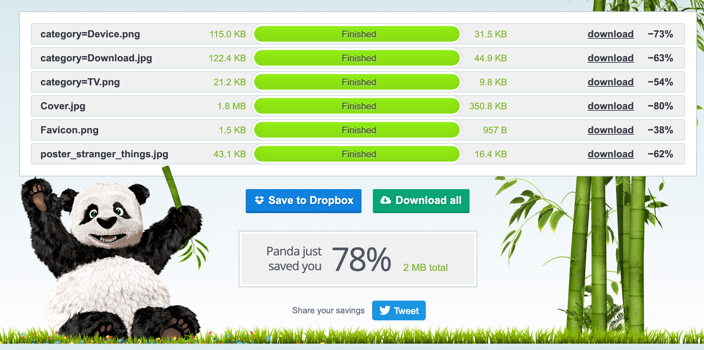
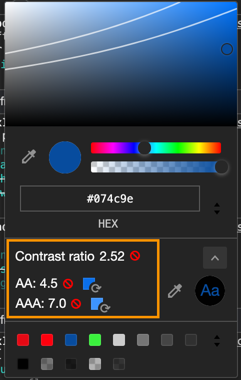
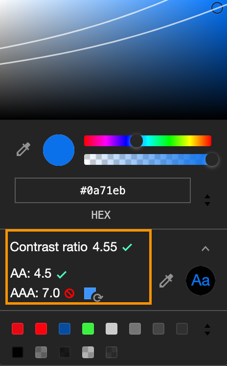
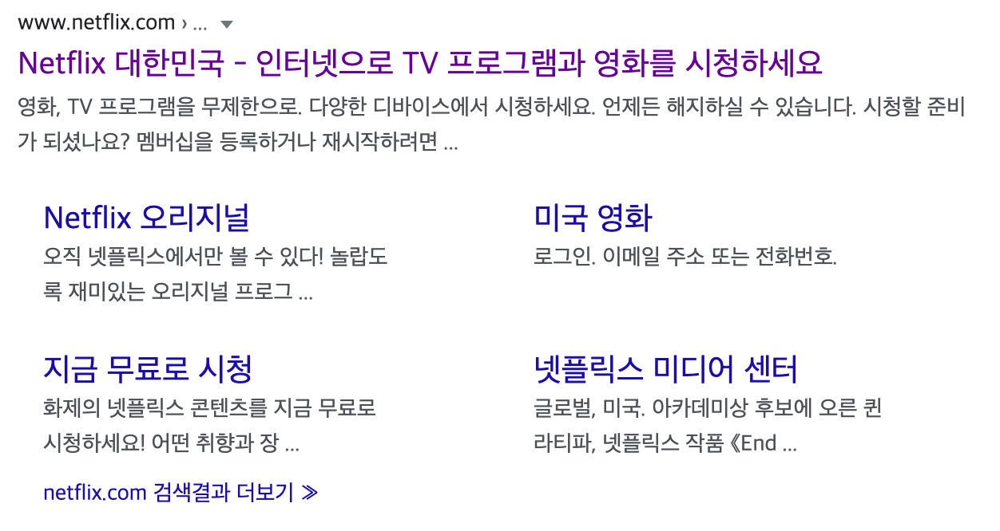

# 개선하기
[Lighthouse(웹 품질 개선 자동화 도구)](https://developers.google.com/web/tools/lighthouse?hl=ko)를 이용하여  웹앱의 성능(`Performance`), 접근성(`Accessibility`), 최적화(`best practice`), 검색 엔진 최적화(`SEO`) 항목을 검사해 문제가 있는 것들 확인하고 개선합니다. 

<br />


## Performance

<details>
  <summary>render-blocking 문제</summary>

  <br />

  `CSS`를 컴포넌트 단위로 작업했기 때문에 불러오는데 시간이 걸렸을 뿐, 번들러를 사용하면 해결된다.

</details>

<br />

<details>
  <summary>HTTP/2 문제</summary>

  <br />

  해당 페이지는 웹 서버에 배포하는 페이지가 아니기 때문에 임시적으로는 보안의 과정이 필요하지 않는다. 

</details>

## Accessibility

<details>
  <summary>role="text" 문제</summary>

  <br />

  `role="text"`는 문제가 없다. `Lighthouse`에서 사용하는 `axe-core`의 버전이 낮아서 아직 적용이 안됐을 뿐이다. 

  [axe-core의 role="text" 관련된 내용 확인](https://github.com/dequelabs/axe-core/issues/1597)

</details>

## best practice

<details>
  <summary>HTTPS 문제</summary>

  <br />

  HTTP/2 문제와 내용 동일 
  

</details>

---

## Performance 개선 내용
<br />

### ⚠️ 이미지 최적화 하기
`TinyPNG` 도구를 사용해서 사용자의 눈에 보이지 않는 부분의 데이터를 감축시켜 이미지의 용량을 줄여준다.



<br />
<br />

### 마크업에 이미지 사이즈 입력하기
<strong>Image elements do not have explicit width and height</strong>

이미지가 로딩되는 동안 브라우저는 이미지/비디오의 공간을 미리 할당한다. 

---

## Accessibility 개선 내용
<br />

### ⚠️ button 요소에 aria-label 적용하기 
스크린 리더 사용자에게 해당 버튼의 사용 용도를 간략하게 전달한다. 

```html
<button class="promotion__button" type="button" aria-label="30일 무료이용 체험">30일 무료 이용</button>
<button type="button" class="resetButton Button" aria-label="답변 보기"></button>
```
[[MDN]aria-label 속성 사용](https://developer.mozilla.org/ko/docs/Web/Accessibility/ARIA/ARIA_Techniques/Using_the_aria-label_attribute#예_1_다수의_레이블)
[ARIA-LABEL 사용하기](https://www.youtube.com/watch?v=ROg2Vs-NMk4&t=45s)

<br />

### ⚠️ render-blocking 문제
<strong>Eliminate render-blocking resources</strong>

해당 문제는 `CSS` 파일을 컴포넌트 방법으로 작업을 해서 각각의 파일을 불러오는데 시간이 걸린다는 것이다. 이것은 번들러를 사용해주면 해결되는 문제이다!

<br />

### ⚠️ 글자 색상 대비 문제 
처음에 적용했던 색상은 기존의 넷플릭스에서 사용하던 색상이다. 이를 접근성 관점에서 개선하였다. 




<br />

### ⚠️ `role="text"`가 문제??
`role="text"`가 문제라는 안내가 떠서 찾아보았다. `Lighthouse`사 사용하는 툴인 [`axe-core`](https://github.com/dequelabs/axe-core/issues/1597)의 `Github`에 들어가보았다. 

위의 사이트의 내용을 보니 `axe-core`에서는 사람들의 건의로 `role="text"`가 접근성에 문제가 되지 않는다라는 것을 인식하고 `v4.1.0` 적용을 했으나 현재 `Lighthouse`에서 사용하는 `axe-core`가 `v3.3.0`을 사용하고 있어서 `role="text"`가 문제가 있다고 뜨는 것이다. 즉, `role="text"`는 문제가 없다.

<del>`<span>`, `<div>`을 사용하면 `Lighthouse`에서 통과가 된다고 한다.</del> → <strong>해봤는데 안된다.</strong>

---
<br />

## SEC
`Search Engine Optimization`(검색엔진최적화)는 브라우저에 검색을 했을 때 해당 웹 페이지가 검색결과 상단에 노출될 수 있도록 하는 것이다.

<br />

### ⚠️ https 보안 개선
우리 사이트는 보안기능을 사용할 수 없기 때문에 이 부분에 대해선 개선이 힘들다. 

[http와 https의 차이](http://blog.wishket.com/http-vs-https-%EC%B0%A8%EC%9D%B4-%EC%95%8C%EB%A9%B4-%EC%82%AC%EC%9D%B4%ED%8A%B8%EC%9D%98-%EB%A0%88%EB%B2%A8%EC%9D%B4-%EB%B3%B4%EC%9D%B8%EB%8B%A4/)

<br />

### ⚠️ meta description을 설정해준다.
<strong>Document does not have a meta description</strong>

```html
<meta content="영화 보기, 온라인 영화, 인터넷 영화, TV 시청, TV 온라인, 온라인 TV 프로그램, 인터넷 TV 프로그램, TV 프로그램 보기, 영화 스트리밍, 스트리밍 tv, 인스턴트 스트리밍, 온라인 시청, 인터넷 시청, 영화, 영화 보기 대한민국, 온라인 TV 보기, 다운로드 불필요, 영화 풀 버전, 전체 영화" name="keywords" />
<meta content="스마트 TV, 태블릿, 스마트폰, PC, 게임 콘솔 등 다양한 디바이스에서 영화와 TV 프로그램을 마음껏 즐기세요." name="description" />
```

