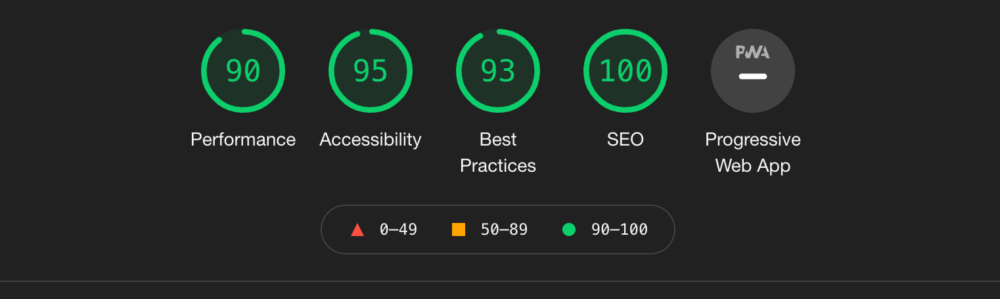

# Make better netflix website 


<br />

- 기존의 넷플릭스 페이지보다 더 개선된 페이지를 만듭니다. 
  - 시멘틱 마크업, 접근성 등
- 다양한 방식으로 페이지를 제작하거나 스타일링 합니다. 
  - Pure Modular CSS, Sass, Tailwind CSS, React


## 스타일 구조
`React`의 모듈화 방식을 참고하여 구조를 구성했습니다.   
  - `엔트리`, `앱`, `구성`, `공통`, `컴포넌트`, `컨테이너`, `레이아웃`, `페이지`

```
stylesheets
│
├── style.css  # 엔트리 파일
├── app.css    # 앱 파일 
├── config.css # 구성 파일 (Color Scheme,...) 
│
├── common/             # 공통 모듈
│   ├── base.css        # 기본 스타일 (reset, a11y, ...)
│   ├── normalize.css   # 브라우저 기본 스타일 일반화
│   ├── typography.css  # 타이포그래피 스타일
│   ├── selection.css   # 셀렉션 스타일(::selection)
│   └── scrollbar.css   # 스크롤바 스타일
│
├── components/              # 컴포넌트 모듈
│   │   ## Header
│   ├── HomeLink.css         # 홈링크
│   │
│   │   ## ourstory
│   ├── OurStory.css         # 아워스토리
│   ├── Promotion.css        # 프로모션
│   │
│   │   ## NetflixIntro
│   ├── NetflixIntro.css     # 넷플릭스 인트로
│   ├── WatchOnTV.css        # 왓치 온 티비
│   ├── DownLoadAndWatch.css # 다운로드 앤 왓치
│   ├── WatchOnDevice.css    # 왓치 온 디바이스 
│   │
│   │   ## NetflixFaQ
│   ├── NetflixFaQ.css       # 넷플릭스 질문과 답변
│   ├── FaQList.css          # 질문과 답변 리스트
│   ├── FaQListItem.css      # 문과 답변 리스트 아이템
│   │
│   │   ## Footer
│   ├── AddressInfo.css      # 어드레스 인포
│   ├── Link.css             # 링크
│   ├── LinkList.css         # 링크 리스트
│   ├── LinkListItem.css     # 링크 리스트 아이템
│   │
│   │   ## Global
│   ├── Button.css           # 버튼
│   ├── Container.css        # 콘테이너
│   ├── Description.css      # 디스크립션
│   ├── Divider.css          # 디바이더
│   └── Dropdown.css         # 드롭다운
│
├── containers/           # 컨테이너 모듈  
│   ├── ourstory.css      # 아워스토리 
│   ├── netflixIntro.css  # 넷플릭스 인트로    
│   └── netflixFaQ.css    # 넷플릭스 FAQ  
│    
├── layout/         # 레이아웃 모듈  
│   ├── header.css  # 헤더   
│   └── footer.css  # 푸터  
│
└── pages/       # 페이지 모듈  
    └── home.css # 홈
```

## 네이밍 작성 규칙

스타일을 위한 이름 작성 규칙입니다. 

### 컴포넌트
타이틀케이스(TitleCase) 방식으로 이름을 작성합니다.

```css
.Container { /* ... */ }
.HomeLink { /* ... */ }
.Link { /* ... */ }
.OurStory { /* ... */ }
.Promotion { /* ... */ }
```

### 페이지/레이아웃/공통/기타
카멜케이스(`camelCase`) 방식 + BEM 개발 방법론(`Block__Element--Modifier`)으로 이름을 작성합니다.

```css
.netflixHeader { /* ... */ }
.netflixFooter { /* ... */ }

.ourStory { /* ... */ }
.ourStory__headline { /* ... */ }
.netflixIntro__downLoadAndWatch--reverse { /* ... */ }

.a11yHidden { /* ... */ }
```

## 웹 최적화 결과

