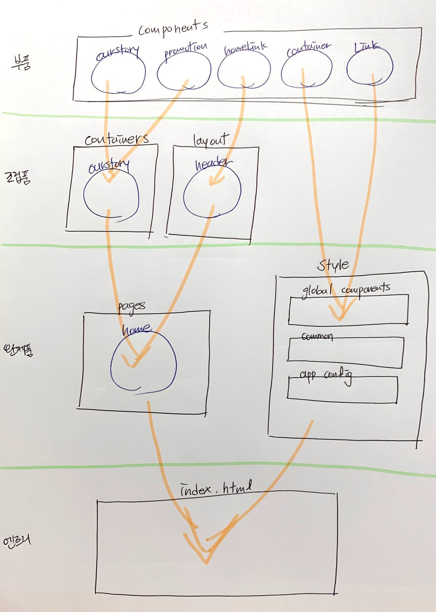

# TIL

20201201 공부한 내용을 기록합니다.

* 벌써 12월이다.
  - 공부를 시작한지 얼마 안된 것 같은데 시간이 정말 빠르다. 잠시라도 좋으니 시간이 멈췄으면 좋겠다. 이번 한 달의 목표는 CSS이다. 이제까지 차근차근 JS 배운 과정을 생각하며 CSS도 무서워말고 차근 차근 실력을 쌓아나가자!
* `CSS` 파일을 독립적으로 사용하기 
  - `React`에서 사용하는 방식으로 `CSS` 파일일을 쪼개서 관리하는 방법을 배웠다. `Sass`를 처음 배웠을 때 모듈화하는 작업을 했을 때가 생각났다. 그때는 독립적으로 파일을 나누는 것에 엄청 혼란스러워서 이해하기 힘들었다. 그래도 한 번 비슷한 경험을 한 적있다고 이런 구조가 낯설지 않는다. 구조만 조금 머릿속에 정리하면 사실 한 파일에 코드를 길게 쓰는 방법 보다는 코드를 나눠서 관리하는 방법이 훨씬 편리한 방법이다. 정리를 잘 해보자. 

# 질문하기

1. 커밋 명령어 사용시 파일 하나만 커밋할 수 있나요? 

## 스타일링 파일 구조

* `/` : 디렉로리를 나타냄

```
stylesheets
├── style.css # 엔트리 파일
├── app.css   # 앱파일 
├── config.css # 구성 파일 (Color Scheme,...)
│
├── common/ # 공통 모듈
│   ├── normalize.css # 브라우저 기본 스타일 일반화
│   ├── base.css # 기본 스타일 (reset, a11y, ...)
│   └── typography.css # 타이포그래피 스타일
│
├── components/ # 컴포넌트 모듈
│   ├── Container.css # 콘테이너
│   ├── HomeLink.css # 홈 링크
│   ├── Link.css # 링크
│   ├── OurStory.css # OurStory 컴포넌트
│   └── Promotion.css # Promotion 컴포넌트
│
├── containers/ # 컨테이너 모듈
│   ├── ourstory.css # ourstory
│   ├── watchOnTV.css # netflixIntro - watchOnTV
│   ├── downLoadAndWatch.css # netflixIntro - downLoadAndWatch 
│   ├── watchOnDevice.css # netflixIntro - watchOnDevice 
│   └── netflixFAQ.css # netflixFAQ 
│
├── layout/ # 레이아웃 모듈 
│   ├── header.css # 헤더 
│   └── footer.css # 푸터
│
└── pages/
    ├── home.css # 홈
    └── login.css # 로그인
```


---




## 넷플릭스 실습

### 알아두기 

* top → above, bottom → below


