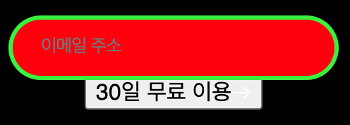
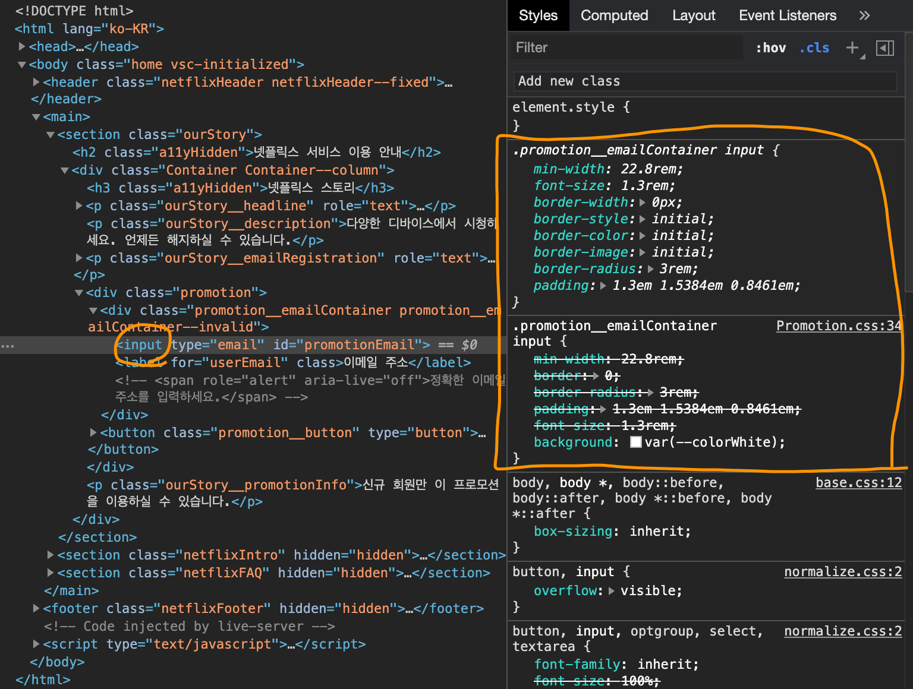

# TIL

20201203 공부한 내용을 기록합니다.

* 스스로 다시 연습하기
  - 

## 질문하기

1. app 과 config를 왜 분리했을까?

1. 컨텐츠의 공간을 rem 값을로 계산할 때는 폰트 사이즈로! 퍼센트로 계산할 때는 전체 너비로!

1. <del>:focus:not(:focus-visible)와 :focus는 같은 상황 아닌가요?</del>

## 기록하기

1. 링크 포커스시에 비비드 컬러 적용 
    ```css
    /* .Link:hover, .Link:focus */ 
    .Link:hover, :focus {
      background: var(--colorVividRed);
    }
    ```

1. 인풋을 클릭 하니 배경이 빨색으로 바뀐다. 왜??????????????(당황)

    - 위에 선택자 때문이었음....😫  `.Link:hover, :focus`는 선택자 리스트이기 때문에 `.Link:hover, .Link:focus`의 의미가 아니다. 

1. `:focus` 정리
    - `:focus-visible`, `:focus:not(:focus-visible)` 이 두가지를 설정했으면 `:focus`로 할 수 있는 모든 경우의 수(마우스, 키보드)는 전부 적용한 걸 텐데 왜 `:focus`를 만들어 줘야 할까?
    - 적용해 보니 `:focus`를 먼저 설정해야 `:focus-visible`의 스타일이 적용된다. 
    ```css
      /* 포커스 적용한 경우 */
      :focus {
        outline: none;
        box-shadow: 0 0 0 0.3rem var(--colorFocusable);
      }

      /* 마우스로 클릭했을 때 */
      :focus:not(:focus-visible) {
        box-shadow: none;
      }

      /* 키보드로 포커싱 되어 화면에 표시 되어야 하는 경우 */
      :focus-visible {
        box-shadow: 0 0 0 0.3rem var(--colorFocusable);
      }
    ```

1. `ourStory__emailRegistration`에 `<br>`에 넣어 줬다. 문장이 한 문장이기 때문에 `ourStory__headline`와 같이 스크린리더 사용자에게 도움을 주기 위해 `role="text"`를 사용한다. 

1. 인풋에 `position`으로 위치를 잡을 떄 rem을 사용하는 것이 아닌 px값을 사용한다.   
왜? 위치를 고정해야 하기 때문이다. 그렇다는 것은 알지만 rem 단위로 값을 잡아도 괜찮지 않을까? rem도 고정값이잖아?

1. 도구 에러  
갑자기 내 코드 무시하는 척 하면서 다 적용시켜 주는건데 왜...?  <del>속성 변경도 못하게 하는건데</del> 왜... 이유라도 알려줘야지....

    

1. `input`뿐만 아니라 `link` 같은 경우에도 `padding` 값을 `em` 값으로 계산 할 때 `px` 값을 16으로 나눈 것이 아니라 해당 컨텐츠에 설정되어 있는 글자 크기 `px` 값으로 나누었다. 또 잊어버린 것 같으니 다시 기억하기 

1. `input` 스타일링 흐름을 다시 기억하자.    
기본적으로 디자인 시안에 나와있는 타이포 그래피 디자인을 적용 → 보더 적용 → 너비 적용 → 포지션 위치 지정 → 패딩값 적용 → / 이제 브라우저에서 확인하면서 포커스 됐을 때 확인하면서 레이블 글자 크기 및 포지션 위치 변경 → 인풋에서 레이블과 인풋의 입력 텍스트 겹치지 않도록 패딩탑 조절

1. 인풋의 포커스 스타일링을 할때 좀 더 쉽게 결과를 확인하는 방법?