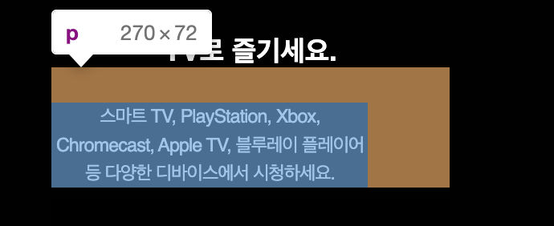
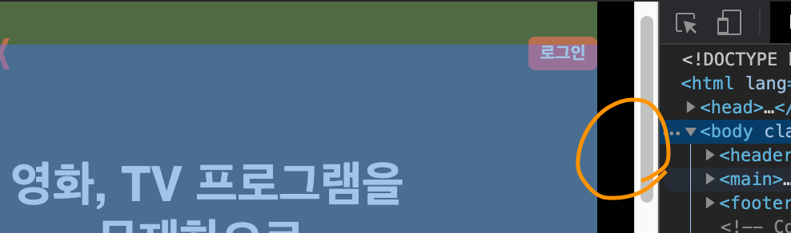
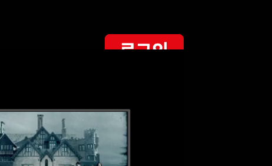

# TIL

20201206 공부한 내용을 기록합니다.

## 질문하기

1. `ourstory`에 적용한 `padding-top:6.6rem`을 `main`에 적용해도 될까요? `main`이나 `body`영역 같은 경우에는 공용 요소이기 때문에 공간에 대한 속성을 되도록 적용하지 않는 것이 좋을까요? 

1. `.resetImg`에 `width: 100%`, `height: auto`을 공용 속성으로 적용해도 괜찮나요?

1. `netflixIntro__downloadContent` 코드 리뷰 같이 하기. 
  - flex와 position을 같이 사용해도 괜찮나요? 

1. `netflixIntro__downloadContent`에 `position: absolute;`을 적용한 다음 `margin-bottom` 값으로 `img`위에서 위치를 조정하려고 했으나 `img`가 형제 요소이기 때문에 컨텐츠가 `img` 올라가지 않았다. 결국 `bottom`값으로 위치를 잡았다. 
  - 위에 설명을 이렇게 적긴 했지만 왜 `absolute`를 적용했을 때 바로 부유되지 않나요? 
  - `position` 속성은 위치 속성을 적용했을 때 실행되나요?

1. `netflixIntro__description`에 `inline-block`과 `inline`을 각각 적용했을 때 자식 요소 `
`의 모양? 형태?에 왜 차이가 있나요? 
  

## 기록하기

1. 작업중 브라우저 전체 화면에서 원인을 알 수 없는 `margin-right` 공간이 생겼다. 내가 잘못 한 건 줄 알고 원인을 찾으려 시간을 꽤 소비했는데 화면을 새로고침하니까 없어졌다. 가끔 이런 오류가 발생할 수 있으니 먼저 새로고침 해보기!
  

1. `netflixIntro`에는 따로 `div`으로 `Container`를 만들어주지 않았기 때문에 `netflixIntro`에 `Container`를 적용

<!-- 1. `netflixIntro`의 비디오 및 이미지 위치 스타일링에 대한 자세한 설명은 `QnA`의 `Q4.질문` 참고 -->

1. `netflixIntro__figure`의 ``에 `class="resetImg"` 적용

1. `figure`에 기본으로 적용되어 있던 `margin`값 제거

1. `img`가 `video`를 덮는 디자인을 구현하기 위해 `z-index`를 사용하려 했으나 `z-index`는 `position`속성(`static`외 다른 요소)을 적용하지 않으면 적용이 힘들었다. 그래서 `position: relative;` 속성 적용했다. `absolute`는 부유해 버리는 특징 때문에 레이아웃이 무너져 버린다. 

1. `netflixIntro`에 ` `가 적용되어 있는 요소에 `role="text"`적용

1. [`role="group"`](https://www.w3.org/TR/wai-aria-1.1/#group) 
  - 그리고 role="group"은 트리 구조를 구현하거나, 드롭 다운 메뉴를 만들 때 사용해요
  - treeitem 역할 또는 menuitem 역할을 가진 요소를 묶을 때 사용합니다
  - 트리구조를 웹에거 구현할 때, 그룹이 필요한 경우 role="group"을 사용할 수 있어요
  - 

1. `downloadIcon`의 수직 위치를 가운데 정렬하기 위해서 ``에 `margin-top: auto; margin-bottom: auto;` 적용

1. `netflixIntro__downloadContent`에서 text의 위치를 잡을 때
  - `text-align: left;`     
  부모요소가 `downloadContent`이다 보니 `text-align: left;` 했을 떄 박스의 왼쪽 끝으로 위치해버린다. 
  - `position: absolute;`      
  앞서 `position` 속성을 많이 사용했기 때문에 브라우저의 성능면으로 봤을 때 좋지 않겠지만 마크업을 수정하지 않고 진행한다는 장점이 있다. 하지만 데스크탑 버전을 생각했을 때 또 다시 위치를 고려해야 한다는 단점이 너무 크다
  - 🎯 선택! `text`를 `div`으로 랩핑한다.       
  마크업을 수정하지 않는 쪽으로 진행하고 싶고 의미없는 컨테이너 요소가 이미 너무 많다. 하지만 데스크탑 버전을 고려했을 때 위치를 조정하거나 수정하는 부분을 생각했을 때 최선의 방법이다. `

1. `netflixIntro`의 컨텐츠가 `header`의 컨텐츠를 덮어버리는 현상을 해결하기 위해 `header`에 `z-index: 10000;` 적용
    

## 고민하기
