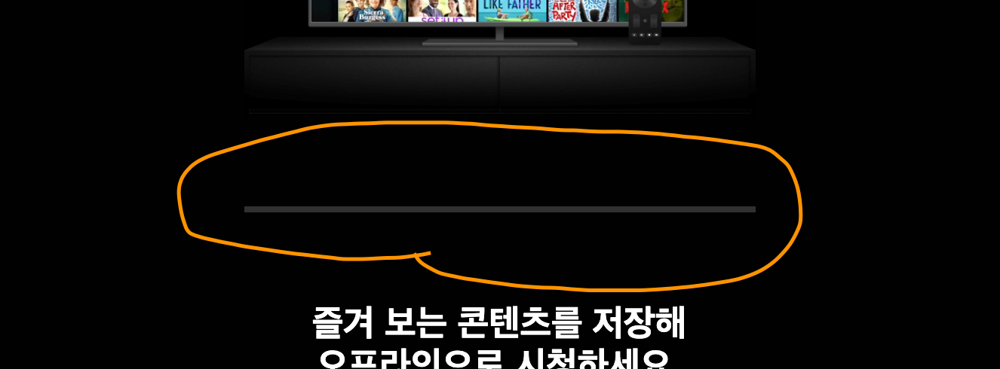
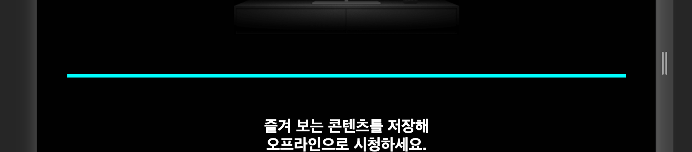
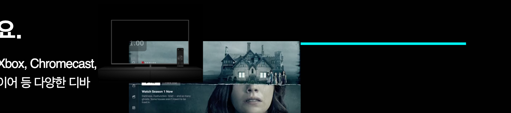

# TIL

20201209 공부한 내용을 기록합니다.

## 질문하기

1. 구분선 태그를 `<article>`의 형제요소로 해주는 것이 좋을까요 아니면 부모요소로 마크업 해주는 것이 좋을까요? 

1. 모바일 버전에서 `dd`의 `font-size`값을 얼마로 지정하는 것이 좋을까요?

1. `id`에 `BEM`표기법을 사용해도 괜찮나요?   
`id="promotionEmail__FAQ"`

1. `netflixIntro__downloadContent` 위치를 잡을 때 `%`를 사용했습니다. 괜찮을까요? 

1. 넷플릭스 원본 페이지를 참고해 아래의 코드를 적용하기 했지만 이해가 되질 않습니다. `width`값보다 `max-width`값이 더 작다? 그런데 구현이 된다? 어떻게 이게 가능한가요? 
    ```css
    .netflixIntro__watchOnTV video {
      width: 100%;
      max-width: 73%;
    }
    ```

## 고민하기 

1. `netflixIntro`에 구분선을 어떻게 적용해야 할까?     


    아래의 이미지는 `<article>`에 `Divider`컴포넌트를 적용한 모습이다. 아쉽게도 `<article>`의 사이즈에 맞춰 구분선이 그려진다. 이는 `netflixIntro`의 `<section>`에 적용해도 비슷한 현상이 나타난다. 해당 요소에 `Container` 컴포넌트를 적용했기 때문에 양 옆의 마진 공간이 그대로 보인다. 
   

   - `<article>`에 `::after`을 사용해 볼까? 

   <br />

   ```css
   article::after {
      content: '';
      /* border-bottom: solid 4px var(--colorDarkGray); */
      background: aqua;
      width: 100%;
      height: 5px;
   }
   ```

   위의 요소를 적용했으나 이미 `netflixIntro`에 적용된 컨터이너의 마진 여백 때문에 소용이 없었다. 

     

   심지어 더 문제점은 데스크탑 버전으로 봤을 때 레이아웃이 무너져버린다. 

     

    <br />
    <br />
    <br />

    - 구분선을 위한 `<div>` 태그 추가     

    구분선을 구현하기 위해서 `<article>` 사이에 `<div>` 요소를 생성 했다. `Container` 컴포넌트에 적용되어 있는 마진 공간 때문에 구분선도 사이즈가 그에 맞춰진다. 그래서  `netflixIntro`의 `<section>` 요소에 적용되어 있던 `Container Container--column` 컴포넌트를 빼고 각 `<article>`에 적용했다. 
    <br />

    위의 방법대로 했더니 원하는 대로 결과가 잘 나온다. 조금 고민이 되는 부분은 구분선 `<div>`태그를 `<article>`의 형제 요소로 마크업 해줘야 할지 아니면 `<article>`을 묶어주는 부모요소로 마크업 해야 할지 고민이다. 

    ```html
      <section class="netflixIntro Divider">
        <article class="netflixIntro__watchOnTV Container Container--column">
        </article>
        <div class="Divider"></div> <!-- 구분선을 위한 마크업 -->
      </section>
    ```

## 기록하기

### netflixFAQ

1. `ourStory__emailRegistration`에 `text-align: center;` 추가     

    <del>`ourStory`의 `Container`에는 `text-align: center;`가 적용되어 있었기 때문에 `ourStory__emailRegistration`가 해당 속성을 상속 받을 수 있었다. 하지만 `netflixFAQ`의 `Container`에는 해당 속성이 적용되어 있지 않기 때문에 `ourStory__emailRegistration` 선택자에 `text-align: center;`를 중복해서 적용한다.</del>

    ```css
    .ourStory__emailRegistration {
      margin-top: 1rem;
      margin-bottom: 0;
      text-align: center;
    }
    ```

    <strong>𝗫 위의 방법 사용 안함! 𝗫</strong> 

    `FaQ`의 `promotion`는 단락 `text`가 데스크탑 버전에서는 줄바뀜되지 않는다.(`ourStory`와는 디자인이 다름) 그래서 `--nobr` "no line break"라는 상태 매세지를 추가 해주어 다시 속성을 적용했다. 줄바꿈을 위해 너비값을 임의로 주었다. 

    ```css
    .ourStory__emailRegistration--nobr {
      width: 29rem;
      text-align: center;
    }
    ```

1. `padding`은 `auto`값을 사용할 수 없다.

1. `.FAQListItem dt`에는 `width: 100%`를 적용할 필요 없다. `dt`는 `block`요소이다.

1. `.Button`의 이미지 위치 맞추기   

    지난 번 `homeLink`와 같은 문제가 발생했다. 버튼과 이미지 크기가 딱 맞지 않고 이지기가 계속 버튼의 공간 밖으로 나가버리는 현상이다. 처음엔 왜 그럴까 계속 고민했는데 보다보니 홈 링크의 문제와 같은 문제였다는 것을 발견했다. 이미 상속된 폰트 사이즈의 값인 `1.5rem`에 행간 `1.5`의 공간 때문에 이미지가 밀려난 것이다. `font-size: 1rem;`을 적용하면서 해결!

    - 버튼 같은 경우엔 너비, 높이 값을 지정해 주어야 한다.
    - `bottom`값을 지정하지 않아도 위치가 변화하지 않기 때문에 삭제!

    <br />

    ```css
    .Button {
      position: absolute;
      padding: 0.205em;
      width: 1.5rem;
      height: 1.5rem;
      font-size: 1rem;
      top: 12px;
      right: 12px;
      /*bottom: 12px;*/
    }
    ```

    `position`으로 위치를 잡으니 또 버튼 밖으로 도망을 가버린다. 아래의 코드로 해결!

    ```css
    .netflixFAQ img {
      width: 100%;
    }
    ```


1. `FAQListItem`의 `dt`의 첫번째 요소에 `margin-top`을 제거  

    위의 공간의 값만 주는 것으로 스타일링 규칙을 세웠다. 시안에 보면 첫번째 요소에 `margin-top`값이 없기 때문에 값을 제거했다.

    ```css
    .netflixFAQ__FAQListItem-1 dt {
      margin-top: 0;
    }
    ```

1. `dt`와 `dd`의 사이 공백을 어떻게 제거할까?   

    결론부터 말하자면 `dd`에 `padding` 값을 주는 것으로 해결되었다. 

    `padding`값을 주는 것을 생각하지 못하고 구글링하며 찾아보았다. 대부분 하는 말이 `dt`와 `dd`에 `clear: both;`와 `float`를 사용해서 해결하라고 하는데... 왜 사용하는지도 모르겠고. 
    
    일시적으로 `float: revert`를 적용하니 사이의 공백이 사라지는 듯 했으나 `FAQListItem`이 첫번째 `dt`와 `dd`를 자식으로 생각하는 것이 아닌 첫번째 `dd`와 두번째 `dt`를 자식으로 생각하는 이슈가 발생했다.  

    결국 자포자기 심정으로 `dd`에 `padding`값을 주었더니 허무하지만 다행스럽게도 해결...!

1. `netflixFAQ`의 아래의 공간을 어떻게 설정하는 것이 좋을까?

    공간의 방향성을 일관적으로(`top`) 주기 위해 `::after`을 사용해보았다. 모바일 버전에서는 가능했다. 하지만 데스크탑 버전에서는 전혀 아래의 속성이 먹히질 않았다. `promotion`에 `flex`가 적용되어 있었는데 데스크탑 버전에서는 `flex-direction: row;`가 설정되어 있어서 모바일에서 보았던 `margin-bottom` 공간이 보이지 않았다. 

    ```css
    .netflixFAQ .promotion::after {
      content: ' ';
      margin-bottom: 6rem;
    }
    ```

    결국, 아래와 같이 해당 요소에 `padding-bottom` 값을 주어 해결했다. 
    ```css
    .netflixFAQ .promotion {
      margin-top: 2.6rem;
      padding-bottom: 6rem;
    }
    ```

## Netflix 원본 페이지와 비교하기 

1. 원본 페이지에서는 `netflixIntro`의 이미지나 동영상의 위치를 잡을 때 `%` 단위를 사용하였다. `%`라면 반응형을 구현하기 위해서 자주 사용하기 때문에 당연히 이미지나 동영상이 위치가 이동하는 문제(내가 스타일링한 페이지에서)를 해결해줄 방법이라고 생각하지 않았다.  

    하지만 스타일링한 방법을 적용해보니 페이지의 크기를 조정할 때마다 이미지와 동영상이 움직이지 않고 딱 위치에 머물러 있었다. 

    의논할 때는 자바스크립트의 힘을 빌리는 방법을 생각했었는데 순수하게 css로도 구현이 가능했다. 아래는 `%` 단위를 사용해서 코드를 수정한 것이다. 

    **아직 내가 적용한 코드가 완벽히 이해된 것은 아니니 다시 보기**

    ```css
     @media (min-width: 60em) {
      .netflixIntro__watchOnTV video {
        /* top: 75px;
        left: 63px;
        width: 35rem; */
        top: 21%;
        left: 13%;
        width: 100%;
        max-width: 73%;
      }

      .netflixIntro__downloadContent {
        padding: 1em 0.75em; /* /16px */
        /* width: 30.2rem;
        margin-right: 8.9rem;
        margin-left: 8.9rem; */
        width: 100%;
        max-width: 65.2%;
        margin: 0 18%;
      }

      .netflixIntro__watchOnDevice video {
        /* top: 39px;
        left: 90px;
        width: 29.5rem; */
        top: 11%;
        left: 19%;
        width: 100%;
        max-width: 61%;
      }
    }
    ```

