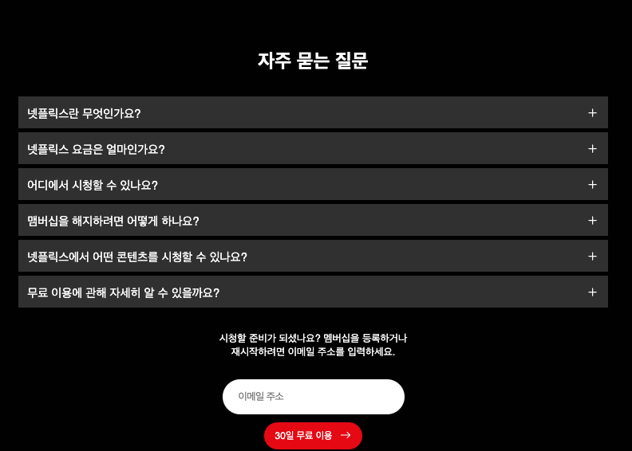
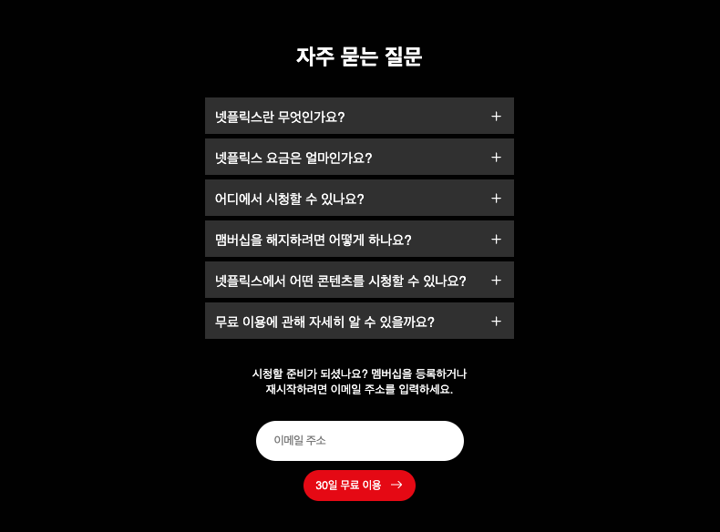
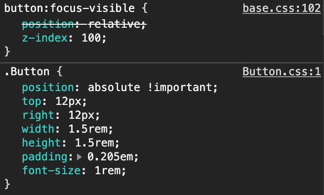

# TIL

20201210 공부한 내용을 기록합니다.

* 마치 내가 프론트엔드 개발자가 된 것 처럼 사고하자!
  - `js`를 고려하여 스타일링 한다던지 수학적으로 계산해서 생각한다 던지 말이다. 또한 클래스로 요소를 제어하는 부분이든 말이다. 

## 기록하기     
9일에 스타일링 작업한 `netflixFAQ`의 코드 리뷰 내용을 기록합니다. 

### netflixFAQ 

#### `FaQList`를 반응형으로 만들 수 있지 않을까? 

  왼쪽의 이미지와 같이 `FaQList`를 반응형으로 만드는 것이 어떤가에 대한 의견이었다. 내가 작업한 결과(오른쪽 이미지)는 좌/우의 여백이 너무 많이 보이기 때문이다. 

  
  

  ##### 작업한 이유 
  위의 컨텐츠들과 흐름을 맞추고 싶었기 때문이다.위의 컨텐츠들은 브라우저의 사이즈가 가변될 때를 생각해서 자연스러운 크기의 변화가 있지 않다고 생각했기 때문이다.(처음엔 이렇게 생각했다.) 
  
  ##### 놓친 부분
   **테블릿 또는 브라우저의 크기가 큰 다른 기종은 고려하지 못했다는 점이다.** 또한 위의 컨텐츠 들은 텍스트를 화면에 보이는 그대로 보기만 하면 됐지만 `FaQ`는 사용자가 해당 질문의 답글을 보기 위해 버튼을 클릭하는 인터렉션이 필요한 요소이다. 만약 테블릿 사용자가 작은 크기의 `FaQ button`을 클릭 할 때 좋지 않은 사용자 경험을 제공할 수 있다.
  
  [코드 수정]
  ```css
   .FaQList {
    min-width: 33.9rem;
    width: 100%;
  }
  ```
#### UX를 위한 FAQListItem의 Button 클릭 영역 확장

`netflixFAQ`의 `Button`에 사용자 경험을 위해 `FAQListItem` 어떤 곳을 클릭하더라도 질문의 답변이 나오도록 한다. `Button`의 크기를 같게하는 것은 어떨까? 
  <!-- - 동영상 1번 16분 30초 확인  -->

#### `<video>`에 반복 재생 기능 추가하기 
동영상이 반복재생되는 기능
  - `<video>` 요소의 `loop` 속성을 사용해서 비디오가 끊임없이 재생되도록 한다.

#### `<video>` 크기 고정 (% 단위 사용)
`netflixIntro`의 이미지와 비디오의 위치를 잡기위해 `css`변수와 `calc()`함수를 사용해주었다. 

#### Divider 설정하기 
1. 구분선을 적용해 주기위해 가상요소(`::before`)를 사용해주었다. 
  - `position: absolute`를 사용, 음수값을 사용해서 구분선을 왼쪽으로 끌어 당김. 
  - 자바스크립트를 이용해줘야 하는지 고민했는데 `css`의 `calc()` 함수가 있어서 순수한 `css`로만 구현이 가능했다. 

  ```css
  Section::before {
    left: calc((100vw - 132rem) / 2 * -1);
    화면의 viewport 100vw - container 132rem /   
  }
  ```

  나는 마크업에 `div`를 사용해서 구분선을 이용했는데 UI에는 문제 없이 적용되고 수학식을 사용하지 않고 간결하게 코드를 작업할 수 있다는 점이 있지만 의미없는 `<div>`를 사용했기 때문에 시멘틱 마크업은 이루지(?) 못했다. 

#### 사용하지 않는 클래스명 정리 그리고 클래스로 요소 제어
`netflixFAQ__FAQListItem-6` 아이템의 넘버링 클래스명은 사용하지 않는데 없애는 것이 어떨까? 
  - 사용하지 않는 클래스명은 정하는 것이 코드의 최적화에 좋다
  - 위와 같은 클래스명을 지우고 `dt`, `dd`에 각각 `FaQListHead`와 `FaQListItem` 클래스만 주었다. 

#### JavaScript를 고려한 아코디언 메뉴 상태 클래스
아코디언 메뉴에 `--open`이라는 상태 클래스를 사용하여 `js`로 제어하는 것은 어떨까? (상태클래스의 중요성)

#### selection 스타일링
텍스트를 선택했을 때 보여지는 색상 : `selection`
  - 명도 대비를 명확하게 
  - 이미지나 링크 컴포넌트에는 select가 가지 않도록 한다. 
  - `selection`는 일반사용자 뿐만아니라 저시력 사용자에게도 많은 도움이 된다. 저시력 사용자가 명도대비가 확실하지 않은 글자를 드래그 했을 때 보다 나은 사용자 경험을 제공할 수 있다. 

#### scrollbar 스타일링
  - 크로스 브라우징을 고려해서 사용한다. 
  - `cuser` 속성 적용 안된다. 
  - 접근성을 위해 `10px`로 두께를 설정 (마우스를 이용하는 사용자에게 스크롤 바를 `cuser`로 보다 쉽게 선택할 수 있는 사용자 경험 제공)

#### 우아한 기능저하 
[우아한 기능저하 내용 보러 바로가기](https://a-tothe-z.tistory.com/8) 

#### px을 소수점 단위로 표현하고 싶을 때 rem 단위를 사용하면 가능할까?
예를 들어 `4.5rem`을 적용했을 때, 어떤 브라우저에서는 `5rem`으로, 다른 브라우저에서는 `4.5rem`으로 다 다르게 적용될 수 있다. 

`px`에 소수점 단위를 사용할 수 없을 뿐더러 `rem`단위를 사용하더라도 브라우저마다 보여지는 값이 다를 수 있다는 것을 염두해 두어야 한다. 

#### flex 속기형을 사용하려고 노력하기
flex-grow 속성보다 flex 속기형을 사용하려고 연습하자!


## 고민하기

1. 브라우저의 너비가 `350px`보다 작아지면 화면의 오른편에 공백이 생겨버리는 이슈

1. 로고의 뒤에 `text`가 있을 경우 로고가 선명하게 보이지 않는 이슈 
    - 헤더의 배경에 톤 다운 효과를 주어 홈링크가 선명하게 보이게 한다(`js`사용)

1. `FAQListItem`의 `Button`에 `focus-visible` 상태일 때 `Button`의 레이아웃이 무너지는 이슈
    

    원인은 미리 적용해둔 `button:focus-visible`의 `p:r`가 실행됐기 떄문이다. 

    `Button`의 `p:a`가 우선적으로 적용될 수 있도록 `!important`사용

     `!important`는 무분별하게 사용해서 문제이지 꼭 필요한 상황해서는 사용해 줘도 괜찮다.


1. 넷플릭스 `width`, `max-width`값을 왜 해당 방식으로 사용했는지 분석해보기

## 방향성 (포트폴리오 준비)
1. 넷플릭스 기존의 페이지와 내가 만든 페이지를 비교할 수 있는 방법 중에 페이지의 최적화를 보여주며 내가 정확하게 어느 부분을 개선했는지 수치로 보여줄 주는 것이 효과적일 것이다. (Lighthouse 웹 표준 점검 도구 이용)
    <!-- - 녹음 파일 37 -->

1. 이미지 최적화 하기 (불필요한 용량을 제거해주는 도구 사용하기)

1. 원본사이트와 비교해서 어떤 것을 개선했다는 것을 브리핑 할 수 있는 방향으로 포트폴리오를 만든다. 
  - 넷플릭스 원본페이지의 문제점을 분석한다. (부분별한 `<div>`, 접근성을 고려하지 않은 글자의 색상, 크기 등)
