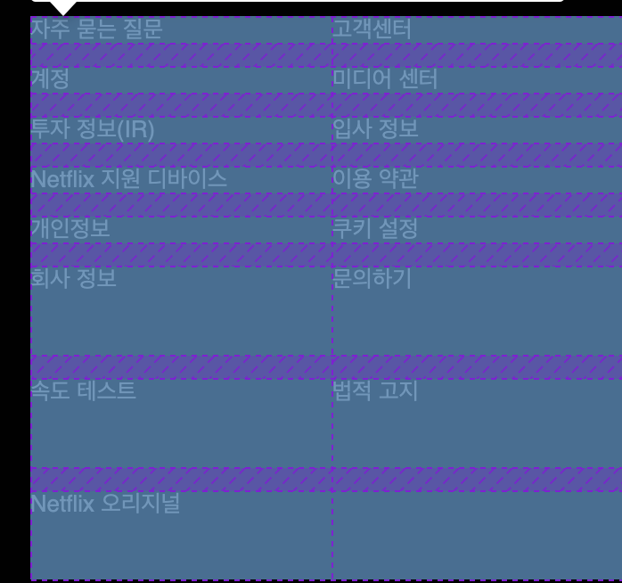

# TIL

20201211 공부한 내용을 기록합니다.

## 질문하기 

1. `tabindex` 속성은 어떤 역할을 하는 속성인가요? 
    - [tabindex 사용에 관한 한국어 번역 글](https://developers.google.com/web/fundamentals/accessibility/focus/using-tabindex?hl=ko)
    - [[MDN]tabindex](https://developer.mozilla.org/ko/docs/Web/HTML/Global_attributes/tabindex#%EC%A0%91%EA%B7%BC%EC%84%B1_%EA%B3%A0%EB%A0%A4%EC%82%AC%ED%95%AD)

1. `비 대화형 요소`란 무엇인가요? 

1. `appearance` 속성은 무엇인가요? 
    - 아래에 간단하게 정리 했으나 `select`요소에서 사용하는 `appearance: none;` 제외한 다른 값, `button` 등에서는 어떤 기능을 하는지 모르겠습니다. `MDN`에서 예제를 보아도 각 다른 값마다 변화(차이)가 없어보여서요

1. `Dropdown`을 마우스로 클릭했을 때 `box-shadow`가 표시됩니다. 해지하는 방법이 있을까요? 아니면 없애면 안되는 부분인가요?                                            

## 기록하기

### netflixFooter

#### Description의 줄바꿈을 어떻게 해결할까?
`Description`의 모바일 버전과 테스크탑 버전에 줄바꿈의 차이가 있다. 줄바꿈을 해야하는 부분이 `text`의 중간이라 고민을 많이 했다. 

- <strong>가상요소를 이용해 줄바꿈하자</strong>

  구글링을 하던 중 `css`의 `content`요소에 `'\a'`를 사용하면 줄바꿈이 가능하다는 정보를 얻었다. 적용해보자.

  [[W3C] '/a' escape sequence 관련 내용 확인하러 가기](https://www.w3.org/TR/CSS2/generate.html#content)

  [How to add a line-break using CSS](https://www.educative.io/edpresso/how-to-add-a-line-break-using-css)

  적용하기에 앞서서 개행되는 `text`를 `<span>`요소로 묶어주기로 한다. 

  ```html
    <p class="description__haveQuestion">질문이 있으신가요? 
      <span>문의 전화: <a class="resetLink" href="tel:00-308-321-0058">00-308-321-0058</a></span>
    </p>
  ```

  [문제] 가상요소 `::before`를 사용하려면 `<span>`이 `description__haveQuestion`의 자식요소가 아닌 형제요소가 되어야 한다. 

  ```html
  <p class="description__haveQuestion description__haveQuestion--lineBreak">질문이 있으신가요?</p>
  <span>문의 전화: <a class="resetLink" href="tel:00-308-321-0058">00-308-321-0058</a></span>
  ```

  [진짜 큰 문제] 가상요소 필요없고 `<span>`으로 감싸면 이미 `Footer__description`와 같이 `block`이기 때문에 데스크탑 버전에서는 `Footer__description`에 `inline-block`만 설정해주면 된다. 

  이럴수가...😂😂 잘 찾았다고 웃어야할지... 왜 이제 알았냐고 울어야할지...🤣


#### LinkList에 Grid 사용하기

처음 계획은 `IE11`까지 고려하는 것으로 계획을 잡았지만 최신 `css` 기능들을 사용하기로 계획을 변경하면서 `Grid`를 적용해보았다.

`LinkList`에서는 전날 `netflixFAQ` 부분 코드리뷰할 때 이야기했던 테블릿 사용자를 위한 `UI`를 고려해서 디스플레이의 너비 `640px`이상이 됐을 때 5*3 행열로 바뀌는 `UI`를 구현했다. 

[[MDN]그리드](https://developer.mozilla.org/ko/docs/Learn/CSS/CSS_layout/Grids#)

#### Grid의 minmax()함수 사용하기

모바일 시안의 `LinkList`룰 스타일링 할 때, `1`의 속성을 먼저 사용하였다. 하지만 최대값이 `auto`라서 그런지 열의 간격이 시안과 딱 맞지 않았다. 

결국 고정값을 주는 `2`번으로 선택!

```css
.LinkList {
  /*  1  */
  grid-template-columns: repeat(2, minmax(16rem, auto));
  
  /*  2  */
  grid-template-columns: repeat(2, 16rem);
}
```

#### 암시적 그리드와 명시적 그리드 차이점

```CSS
.LinkList {
  display: grid;
  grid-template-columns: repeat(2, minmax(16rem, auto));
  grid-template-rows: repeat(5, 1fr);   /* 명시적 */
  grid-auto-rows: 50px;                 /* 암시적 */
}
```
`grid-auto-rows: 100px;`는 위에 명시적으로 정한 5개 열을 제외한 나머지 3개 열('회사정보'부터)은 `50px`을 갖고 있는 것을 볼 수 있다. 

열과 행에 `auto-fill`기능을 사용한다면 사용할 일은 없겠지만 갯수를 명시적으로 정한다면 유지보수를 생각했을 때 필요한 기능일 것 같다!



<br />
<br />

[[MDN]암시적 그리드와 명시적 그리드](https://developer.mozilla.org/ko/docs/Learn/CSS/CSS_layout/Grids#암시적_그리드와_명시적_그리드)

### Footer

#### Dropdown(`<select>`) 스타일링 하기

`<select>`에 CSS 스타일링을 막상 해보려고 하니 뭐부터 손대야할지 막막하다. 그리고 생각했던 대로 스타일링이 적용되지도 않는다. 안그래도 MDN에 찾아보니 여기서도 스타일링이 힘들다는 것을 언급하고 있다. 그래도 도전!

[[MDN]`<select>` Element - CSS styling](https://developer.mozilla.org/ko/docs/Web/HTML/Element/select#CSS_%EC%8A%A4%ED%83%80%EC%9D%BC%EB%A7%81)

##### Dropdown 스타일링을 위한 라이브러리 참고

`Custom Select`에 관한 라이브러리를 찾아 봤지만 전부 `JavaScript` 또는 `jQuery`를 사용한 것들이 많았다. 

[[w3schools]Custom Select Box](https://www.w3schools.com/howto/howto_custom_select.asp)

[[codepen]CUSTOM SELECT](https://codepen.io/wallaceerick/pen/ctsCz)

열심히 구글링을 하던 중 순수한 CSS로 만들 수 있는 방법을 안내한 사이트를 발견했다. 

[[moderncss]select box CSS](https://webclub.tistory.com/235)

#### appearance 속성이란?
`appearance` : 외형, 겉보기  

브라우저에서 네이티브로 지원되는 모양들을 해제하거나 추가할때 이 속성을 이용할 수 있다.

예를 들어 `<select>`의 화살표도 모든 브라우저(`Firefox`, `Chrome` 등)에서 같은 모양으로 보여지는 것이 아니라 각각 다른 모양으로 보여진다.   
이때 `appearance` 속성을 사용하면 각 브라우저에서 네이티브로 지원하는 화살표도 모양을 해제하고 개발자가 원하는 이미지로 추가 할 수 있다. 

[[MDN]appearance](https://developer.mozilla.org/ko/docs/Web/CSS/appearance)

[CSS3 외형(Appearance) 속성](https://webdir.tistory.com/430)

#### Dropdown의 화살표, 글로벌 아이콘 스타일링

`background`를 통해 시안의 이미지를 적용해 주었다. `background-color`은 속기형을 사용하면 기본적으로 `inherit`(상속)이 된다. 속기형을 사용하지 않을 때는 따로 적용해 줘야함.

`background`로 이미지를 적용한거라 `background-position`으로 위치를 잡아야하한다(`p:a`로 위치 잡으려고 했었다. 절대 움직일리가 없지)

```CSS
.Dropdown__arrow {
  /* 화살표 스타일링 */
  background: no-repeat 91.1504% 50% url(../../assets/select_arrow.svg),
    no-repeat 8.8495% 50% url(../../assets/select_global.svg);
}
```


