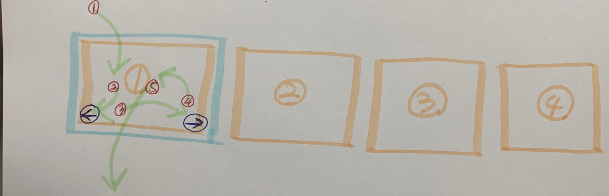

# TIL

20201211 공부한 내용을 기록합니다.

## 기록하기

11일에 스타일링 작업한 `Footer`의 코드 리뷰 내용을 기록합니다. 

<br />

### `<abbr>` 요소 제대로 알고 사용하기 

`<abbr>`요소는 `Abbreviation`(축약)의 약자이다. 

아래의 컨텐츠에 `<abbr>`를 사용해준 이유는 `IR`이라는 축약어에 대한 풀네임을 사용자에게 제공해주기 위함이다. 하지만 난... 제공해주려 만든 `text`를 아무도 모르게 감춰버렸다.😓

[수정 전]
```html
<a class="resetLink" href="">투자 정보(IR)<abbr class="a11yHidden">Investor Relations</abbr></a>
```

요소를 사용하기 전 요소의 역할을 다시 한 번 확인하고 그 역할에 맞게 사용하기로 하자!

[수정 후]
```html
<a class="resetLink" href="">투자 정보<abbr title="Investor Relations">(IR)</abbr></a>
```

```css
abbr[title] {
  cursor: help;
  text-decoration: none;
}
```

#### 참고

[[MDN]`<abbr>`](https://developer.mozilla.org/ko/docs/Web/HTML/Element/abbr)

<br />

### 넷플릭스 서비시스 코리아? 서비시스?

넷플릭스의 연락 정보에 보면 `Netflix Services Korea`를 "넷플릭스서비시스코리아"로 번역했다. 그리고 띄어쓰기도 제대로 되어있지 않다. 해당 영어를 그대로 직역한 경우인데, 한국인이 사용하는 사이트인 것을 생각하여 <strong>서비시스를 서비스로, 그리고 띄어쓰기</strong>까지 해주는 것으로 결정!

### `footer` `<b>`를 일관성있게 사용해볼까?

#### 내 의견 
연락 정보에서 `<b>`를 사용한 이유는 제목과 내용을 구분하기 위해서이다. 기존의 넷플릭스 사이트를 보면 연락 정보의 제목과 내용이 구분이 되어 있지 않아서 한 눈에 알아보기 힘들다는 단점이 있다. 그 점을 개선하기 위해 `<b>`요소를 사용했다.

#### 의견 1
`<b>`는 글자를 굵게 처리해서 주변 맥락과 구분하기 위한 용도로 사용한다. 해당 의도로 사용한 것은 좋았으나 일관성을 위해 위의 본문인 "문의 전화"에도 `<b>`태그를 사용했으면 더 좋지 않을까?

#### 정리
위의 "문의 전화"는 글자의 크기가 크고 사용자가 충분히 문의 전화임을 알아 보기에 어려움이 없다는 생각으로 `<b>`를 사용하지 않았다. 하지만 `UI`에는 차이가 없더라도 같은 역할을 하는 컨텐츠라면 일관성을 지키는 것이 좋겠다. 그리고 마크업을 스타일링을 목적으로 사용하지 않도록 노력해야겠다. 

### `<adress>` 제목이 필요할까?

#### 의견 1
`footer`안에 `<adress>`가 있다는 것 만으로도 맥락상 연락 정보, 저작권 정보라는 의미를 줄 수 있기 때문에 제목요소를 사용해서 "연락정보"를 알려 줄 필요가 있을까?

#### 의견 2
사용자 관점에서 봤을 때 제목간 탐색을 통해 연락 정보에 손쉽게 접근할 수 있기 때문에 사용자에게 편리함을 줄 수 있다. 

#### 정리 
현재 넷플릭스에서는 사이트의 개선, 사용자의 편리함을 중점으로 페이지를 만들고 있기 때문에 제목을 설정해 주는 것이 더 맞다고 생각한다. 하지만 피드백을 통해 이런 넷플릭스가 아닌 다른 페이지를 마크업 할 때 해당 페이지의 `footer`가 어떤 내용을 담고 있는지를 확인하고 상황에 맞게 마크업 할 수 있을 것이다. 

### `footer`에 `<nav>` 요소를 사용하는 것
과거의 `footer`는 많은 내용을 담고 있지 않기 때문에 `<nav>`요소를 사용 하지 않았다 또한 `<nav>`가 많아 지는 것은 혼란을 유발할 수 있기 때문이다. 

하지만 요즘에는 `header`나 `footer`에는 과거와 다르게 많고 다양한 정보를 담고 있기 때문에 `<nav>`를 사용하는 추세이다. 

<br />

## 공부하기

### tabindex 속성

`tabindex`는 크게 `양의 값`, `0`, `음의 값`을 사용하는 경우로 나눌 수 있다. 

#### tabindex="양수"

임의로 `tabindex`의 순서를 지정하는 것이다. 지정한 값에 따라 작은 값부터 높은 값으로 이동한다. 이는 사용자의 자율성에 좋지 않은 경험을 줄 수 있기 떄문에 `0`보다 큰 값은 사용하지 않는 것이 좋다. 또한 이런 패턴은 **안티패턴**이라고도 한다. "제발 사용하지 말아라!"라는 이야기로 해석해도 충분하다. 

#### tabindex="0"

비포커스 요소이지만 포커스가 될 수 있도록 한다. 

#### ⭐️tabindex="-1" (중요)⭐️

무조건적으로 포커스가 되지 않고 사용자가 선택적으로 포커스 할 수 있는 기능을 한다. 키보드만을 이용하는 사용자에게 좋은 `UX`를 제공할 수 있다. 말이 처음엔 어렵겠지만 그림으로 보자! 

`Carousel` 예제를 보면 이해가 쉽다. 아래 이미지 4개가 있다. 이때 4개의 이미지에 `tabindex="-1"`을 설정해주면 사용자가 `→`버튼을 클릭하지 않는다면 자동으로 `tabfocus`가 가지않고 지나가게 된다. 

이와 같은경우는 해외의 `Carousel`에서 자주 사용해주는 방법이다. 이와 같이 `tabindex="-1"`을 이용한다면 사용자는 이미지를 불필요하게 이미지를 전부 확인하지 않아도 다른 컨텐츠로 이동할 수 있다. 



추가로, 전부는 아니지만 대부분 해당 기능은 `JavaScript`와 함께 사용한다. 키보드를 이용해 `tabfocus`를 탐색하는 기능도 `JavaScript`로 구현할 수 있다. 

현재 우리나라에서는 위와 같은 접근성을 고려한 기능을 많이 사용해주지 않는다고 한다. 강사님과 같이 다른 사이트를 방문해보니 정말 그렇다. 모든 사용자를 고려하는 마크업을 하고 그들을 위한 접근성 기능을 구현하는 것에 사명감을 가지고 초심을 잃지 않는 내가 되기를 기도한다. 

#### 참고

- [Carousel 예제](https://www.w3.org/TR/wai-aria-practices-1.1/examples/carousel/carousel-1.html) 

- [tabindex 사용에 관한 한국어 번역 글 → tabindex="음수" 사용예제](https://developers.google.com/web/fundamentals/accessibility/focus/using-tabindex?hl=ko#%EA%B5%AC%EC%84%B1_%EC%9A%94%EC%86%8C%EC%97%90%EC%84%9C_%ED%8F%AC%EC%BB%A4%EC%8A%A4_%EA%B4%80%EB%A6%AC)
 
- [[MDN]tabindex](https://developer.mozilla.org/ko/docs/Web/HTML/Global_attributes/tabindex#%EC%A0%91%EA%B7%BC%EC%84%B1_%EA%B3%A0%EB%A0%A4%EC%82%AC%ED%95%AD)


### Hexo 

[Hexo 블로그 생성 참고 영상](https://www.youtube.com/user/seulbinim/videos?view_as=subscriber)