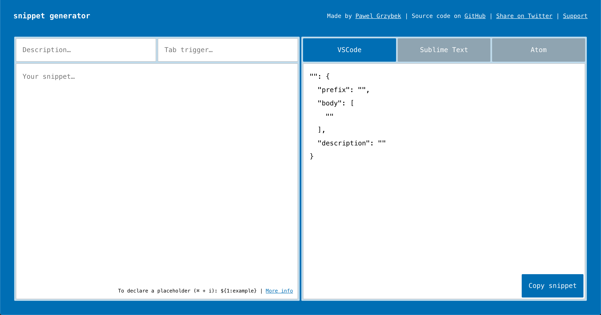
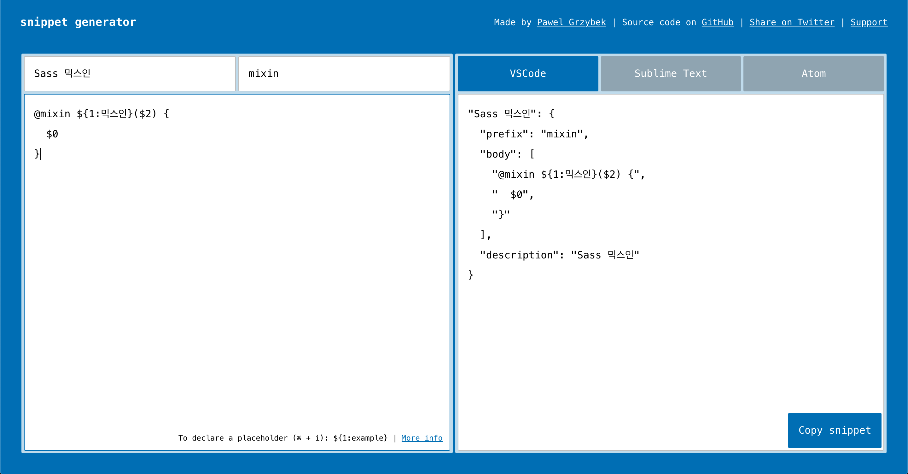
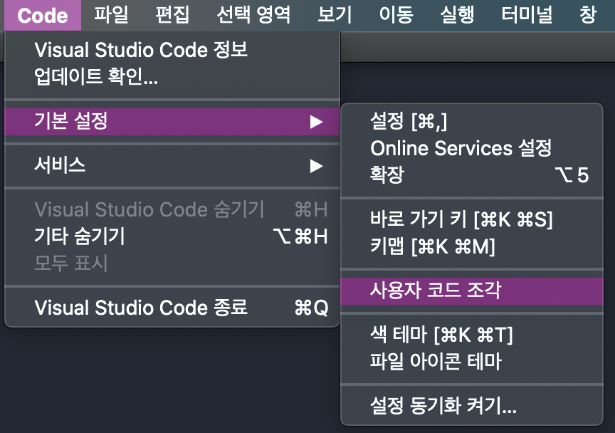
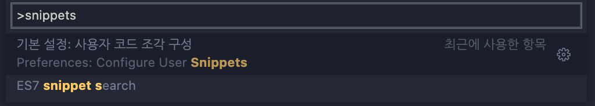
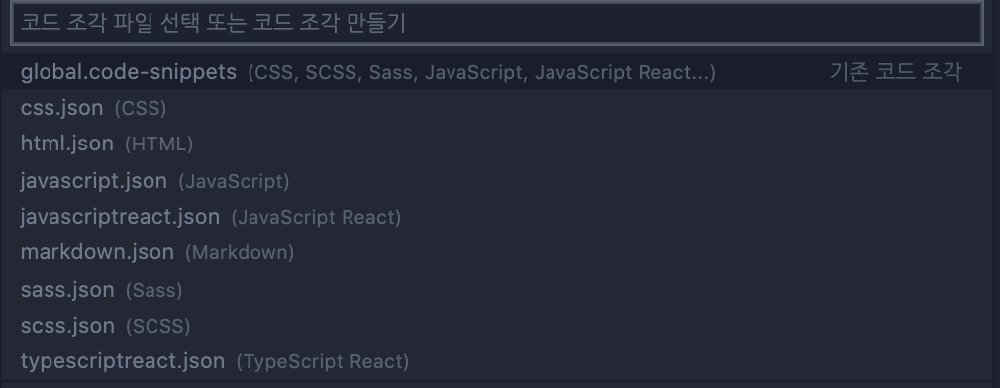

# VS Code Snippet
VS Code Snippet(코드 조각) 만들기 

`VS Code`에서 `HTML`, `CSS` 작업을 할 때 태그나 속성의 몇 글자만 입력해도 뚝딱!하고 만들어진다. 하지만 `Sass`는 `@import`나 `@mixin`, `@include`등을 일일이 입력해야 한다. 또한 커스텀 `Mixin`을 사용할 때 매번 `Mixin`의 이름을 기억해서 입력해줘야 한다는 것이 불편했다. 이럴 때 필요한 것이 `Snippet`! 😅 불편하면 도구를 사용해서 몸을 편하게 하자! 

## Snippet 생성하기
`json`파일에 직접 입력하는 방법도 있지만 [snippet-generator](https://snippet-generator.app/)에서 쉽게 Snippet 코드를 만들어준다. 


[snippet-generator](https://snippet-generator.app/)에 들어가면 아래와 같은 화면이 나온다.



<br />
<br />

- Description : Snippet 이름
- Tab trigger : Snippet 단축어
- Your snippet : 만들고 싶은 Snippet 

<br />

[예시]



<br />
<br />

`${1:example}`, `$2`, `$3`, ..., `$0` 을 이용해 Tab 포커스 순서를 지정할 수 있다. 

> [tabstops]  
> `${1:example}`는 Tabstop에 내용을 입력할 수 있다.  
> `$2`, `$3`, ... Tabstop 순서를 순차적으로 지정 할 수있다.   
> `$0`은 마지막 Tabstop를 지정한다.   
>
> [tabstops](https://code.visualstudio.com/docs/editor/userdefinedsnippets#_tabstops)에 대한 자세한 내용은 링크 참고!

<br />

## Snippet 적용하기

이제 만들어진 `Snippet`을 복사해서 코드 조각 구성 `json` 파일에 붙여 주어야 한다.

<br />

`Code` → 기본 설정 → 사용자 코드 조각으로 들어가거나 


(`Mac` 기준) `cmd` + `shift` + `P`을 이용해 `Snippet`을 검색해주는 방법으로 들어간다. 



<br />
<br />

그 다음 아래와 같은 창이 뜨는데 여기서 해당되는 `json` 파일을 선택해서 붙여넣기 하면 된다. 



<br />
<br />

> 🟣 추가!  
> scope에 해당 코드 조각을 호출할 수 있는 확장자를 입력하면 여러 확장자 파일에서도 만든 코드 조각을 사용할 수 있다.

## Snippet 사용 예제
```json
{
  "Scss 믹스인": {
    "scope": "scss",
    "prefix": "mixin",
    "body": [
      "@mixin ${1:믹스인}($2) {",
      "  $0",
      "}"
    ],
    "description": "Scss 믹스인",
  },
}
```