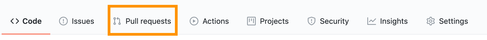
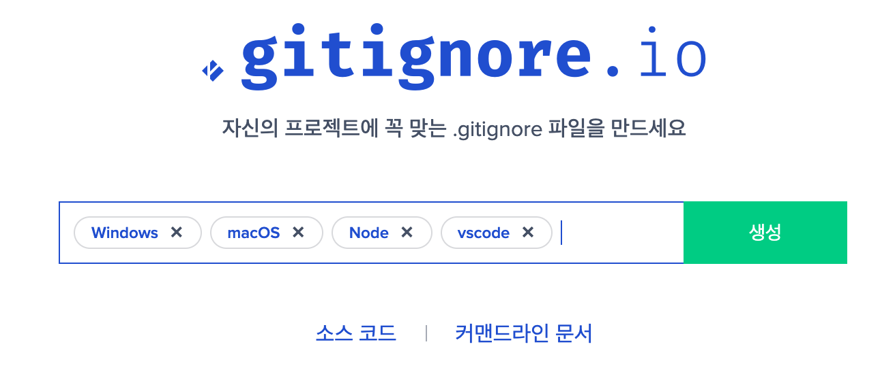

# Let's learn Git!

## 풀 리퀘스트 (Pull requests)



`Pull requests`란?
  - 오픈 소스를 기여할 때 사용한다. 예를들어 다른 사람의 저장소를 포크(fork)한 후에 뭔가 **제안**할 때 사용하는 기능이다. 
  - 그래서 저장소가 본인의 것이거나, 현재 협업자로 등록이 되어 있다면 바로 수정이 가능하기 때문에 사용할 일이 없다.


## gitignore 

간혹 브랜치 간의 충돌을 피하거나 건들이지 말아야 하는 파일 같은 경우 `push`하지 않도록 해야 하는 경우가 있다. 
이 때, 특정 파일이나 폴더를 git에서 관리 하지 않고 무시하도록 설정하는 기능을 한다. 

<br />

[gitignore](https://www.toptal.com/developers/gitignore) 페이지에 들어가서 소스를 가져올 수도 있다. 


특정 파일이나 폴더를 추가 할 수도 있다.
```
# 특정 파일 무시
style.css

# 해당 확장자 모든 파일 무시
*.css 

# 폴더 무시
css 
```

[예시] src 폴더 안에 있는 모든 폴더 중 .css 확장자를 가진 모든 파일 무시
```
src/**/*.css
```

### 주석 처리

`#`를 사용해서 주석 처리 한다. 

### 실행하기

`gitignore`를 변경했다면 커밋까지 마쳐야 적용된다. 


