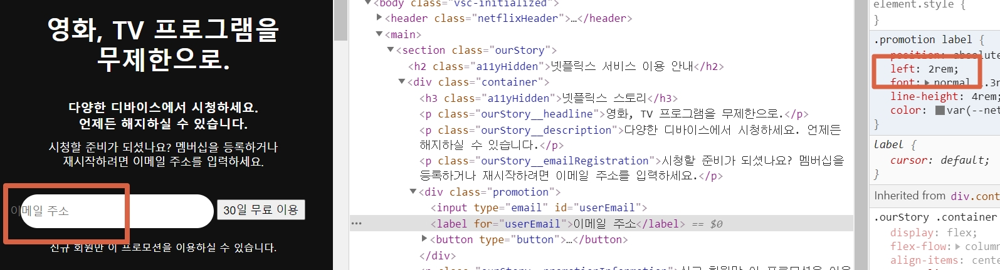
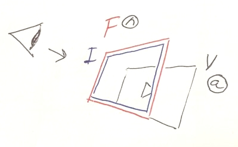
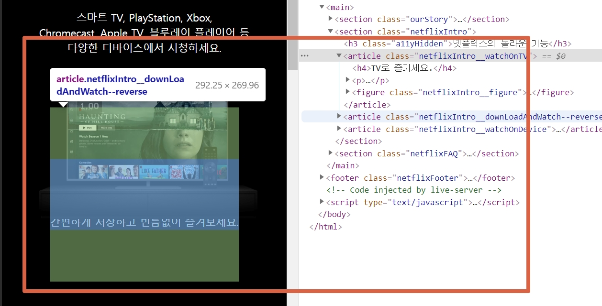
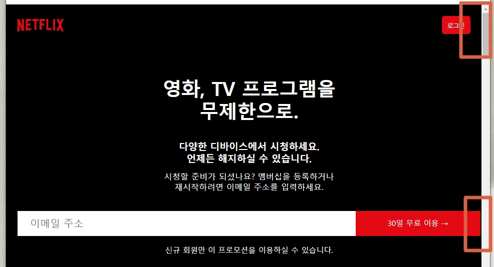
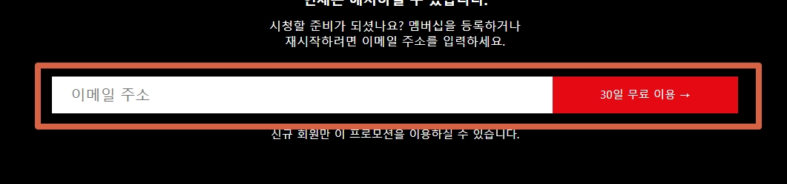
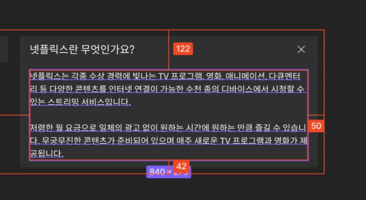
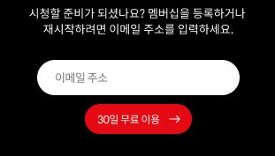

# QnA

## 목차

1. [`:root`에 적용한 속성이 왜 전체(다른 요소)에 적용이 안되나요?](#q1-질문)
1. [`ourStory` 부분에서 본문의 줄바꿈 하는 방법](#q2-질문)
1. [`<input>` 안에서 `<label>` 텍스트 위치 잡는 방법](#q3-질문)
1. [`<article>`요소가 `<figure>`요소를 자식요소로 생각하지 않습니다. 왜그럴까요?](#q4-질문)
1. [감춤 스타일링 하는 방법](#q5-질문)
1. [브라우저의 크기를 줄일 때 보이는 여백의 차이는 왜 생기는 건가요?](#q6-질문)
1. [`<input>`과 `<button>`의 레이아웃을 잡을 때 높이를 딱 맞게 맞추는 방법이 있나요?](#q7-질문)
1. [컴포넌트의 사이즈 기준이 데스크탑일 경우 모바일 버전에서는 폰트 사이즈를 어떻게 설정해야 할까요?](#q8-질문)
1. [마크업을 재사용할 때 재사용에 관련된 클래스 명으로 변경해 주는 것이 맞을까요?](#q9-질문)
1. [주석을 설정할 때는 어떤 식으로 스타일을 적용하나요?](#q10-질문)
1. [css 스타일 코드를 정렬할 때 대부분 어떤 순서로 정렬하나요?](#q11-질문)
1. [`<option>` 태그에 이미지를 삽입하는 방법이 있나요?](#q12-질문)
1. [`::after` 또는 `:last-child`를 사용해서 `margin-botton`값을 적용할 수 없나요?](#q13-질문)

## Q14. 질문

비디오에 `autoplay`를 적용했으나 자동재생이 안될까?

<details open>
  <summary>A14. 답변</summary>
  <br/>
  
  `muted` 속성을 설정하지 않았기 때문이다. 접근성의 문제로 소리가 나는 비디오가 자동으로 재생됐을 경우 소리 때문에 사용자가 놀랄 수 있다. 그래서 자동 재생 설정시에 소리가 나지 않도록 `muted`를 함께 적용해야 한다. 

  ```html
  <video src="assets/video-tv-0819.m4v" autoplay muted></video>
  ```
</details>

<br/>

## Q1. 질문

`:root`에 적용한 속성이 왜 전체(다른 요소)에 적용이 안되나요?

<details>
  <summary>A1. 답변</summary>
  <br/>
  
  아래와 같이 루트에 속성을 적용해도 다른 요소에는 적용이 되지 않습니다. `:root`에 적용하는 것이 `html`요소에 적용하는 것 아닌가요?
  ```css
  :root {
    display: block;
    margin: 0;
    padding: 0;
    font-size: 10px;
  }
  ```

답변 : 공간에 대한 속성은 상속이 되지 않는다. `*`를 사용해서 전체에 공간 설정을 하는 것은 무책임하다 그냥 사용하지 말자

</details>

<br/>

## Q2. 질문

`ourStory` 부분에서 본문의 줄바꿈 하는 방법

<details>
  <summary>A2. 답변</summary>
  <br/>

추가 사항!
`ourStory` 뿐만 아니라 `footer` 부분에서도 "질문이 있으신가요? 문의 전화:" 이 단락에서 줄 바꿈 하는 방법을 모르겠어요!

</details>

<br/>

## Q3. 질문

`<input>` 안에서 `<label>` 텍스트 위치 잡는 방법

<details>
  <summary>A3. 답변</summary>
  <br/>
  
 질문 추가 설명: `<input>` 자식 요소인 `<label>`요소에 `position: absolute; left: 2rem;` 주었는데 `<input>`컨텐츠 밖으로 나갑니다 왜그럴까요?

A : `<input>`요소를 기준으로 `<label>`의 위치를 고정 하고 싶다면 `<input>`과 `<label>`를 또 다른 컨테이너로 랩핑해주면 된다. 즉, `<input>`
에 `p:r`, `<label>`에 `p:a`를 적용한다.

<br />



```css
input {
  border: 0;
  padding: 0;
}

.promotion input {
  position: relative;
  width: 22.8rem;
  height: 4rem;
  border-radius: 50px;
}

.promotion label {
  position: absolute;
  left: 5rem;
  font: normal 1.3rem spoqaHanSans;
  line-height: 4rem;
  color: var(--netflix-gray);
}
```

</details>

<br/>

## Q4. 질문

`<article>`요소가 `<figure>`요소를 자식요소로 생각하지 않습니다. 왜그럴까요?

<details>
  <summary>A4. 답변</summary>
  <br/>

질문 추가 설명: 이미지와 비디오에 `absolute`가 설정되어 있기때문에 뒤에 요소가 이미지의 자리를 인식하지 못한다. 그러면 피규어에 마지막 자식 가상요소를 사용해야 할까?

A:



- 위의 사진을 참고해서 보면 `<figure>`안에 ``가 있고 `` 아래에 `<video>`가 있다. 즉, ``와 `<video>`를 감싸고 있는 컨테이너는 `<figure>`라는 것이다.
- 내가 실수 한 것은 이미지에 `absolute`를 적용하는 바람에 뒷 요소 뿐만 아니라 `<figure>`조차 ``와 `<video>`의 공간을 인식하지 못하게 한 것이다.
- 그러므로 ``에 `p:r`를 주는 것이 아니라 `<figure>`에 `p:r` 주고 `<video>`에 `p:a`를 주어 위치를 잡으면 해결~!  
  이미지는 이미 초기화 속성으로 `vertical-align: middle;`을 주었기 때문에 부모 요소 크기에 딱 맞춰져 있다. 이미지에는 `position`속성을 줄 필요가 없음!

```css
[해결] .netflixIntro__figure {
  position: relative;
}

.netflixIntro__watchOnTV img {
  vertical-align: middle;
  width: 100%
}

.netflixIntro__watchOnTV video {
  position: absolute;
}
```

---



```css
.netflixIntro__figure {
  position: relative;
}

.netflixIntro__watchOnTV img {
  position: absolute;
  z-index: 100;
  width: 338px;
}

.netflixIntro__watchOnTV video {
  position: absolute;
  top: 52px;
  left: 43px;
  z-index: 10;
  width: 250px;
}
```

</details>

<br/>

## Q5. 질문

감춤 스타일링 하는 방법

<details open>
  <summary>A5. 답변</summary>
  <br/>
  
  ```css
  .a11yHidden {
      overflow: hidden;
      position: absolute;
      clip: rect(0, 0, 0, 0);
      /* clip-path: inset(50%); */
      clip-path: circle(0%);
      width: 1px;
      height: 1px;
      margin: -1px;
      white-space: nowrap;
  }
  ```
* 속성 분석해 보기
```css
.a11yHidden {
  white-space: nowrap;
}
```

- `text`가 많을 때 개행 된다면 아래의 공간으로 `text`가 보일 수 있다. 그래서 `norwrap` 속성을 사용하면 텍스트가 개행되지 않아 감출 수 있게 된다.

```css
overflow: hidden;
```

```css
width: 1px;
height: 1px;
```

- 박스의 공간을 최소 한으로 줄인다.

```css
position: absolute;
```

</details>

<br/>

## Q6. 질문

브라우저의 크기를 줄일 때 보이는 여백의 차이는 왜 생기는 건가요?

<details open>
  <summary>A6. 답변</summary>
  <br/>
  
  보여지는 컨텐츠를 감싸는 컨테이너는 동일 합니다. 그런데 브라우저의 크기를 줄였을때 헤더의 여백은 일정하게 보이지만 아래 버튼의 오른쪽 공백은 공간이 없이 보입니다. 같은 스타일링을 준 컨테이너로 감싼 컨텐츠인데 왜 여백의 공간이 다른건가요?

[참고 -> 깃허브 코드 저장](https://github.com/hanna244/netflix_fixed_design/commit/cc299eae00e98ef38a9e7bc071699d590f1f4281)



</details>

<br/>

## Q7. 질문

`<input>`과 `<button>`의 레이아웃을 잡을 때 높이를 딱 맞게 맞추는 방법이 있나요?

<details open>
  <summary>A7. 답변</summary>
  <br/>

아래의 레이아웃을 잡을 때는 `margin-left: -0.4rem; padding-top: 0.8em;`을 사용해서 임의로 위치를 비슷해 보이도록 설정했습니다. 위치를 딱 알맞게 하기 위한 방법이 있을 까요?

[참고 -> 깃허브 코드 저장](https://github.com/hanna244/netflix_fixed_design/commit/cc299eae00e98ef38a9e7bc071699d590f1f4281)



```css
.promotion input {
  width: 22.8rem;
  height: 4rem;
  border-radius: 50px;
}

.promotion button {
  background-color: var(--netflix-red);
  font: normal 1.2rem spoqaHanSans;
  line-height: 135%;
  color: var(--netflix-white);
  padding: 0.9375em 1.25em;
  margin-left: auto;
  margin-right: auto;
  margin-top: 1rem;
  border-radius: 90px;
}

@media (min-width: 750px) {
  .promotion input {
    width: 54rem;
    border-radius: 0;
  }
  .promotion button {
    display: inline;
    margin: 0;
    border-radius: 0;
    margin-left: -0.4rem;
    height: 4rem;
    padding-top: 0.8em;
    /* font-size: 2.2rem; */
    width: 20rem;
  }
}
```

</details>

<br/>

## Q8. 질문

모바일 사이즈를 기준으로 제작을 하고 있을 때 컴포넌트의 사이즈 기준이 데스크탑일 경우 폰트 사이즈를 어떻게 설정해야 할까요?

<details open>
  <summary>A8. 답변</summary>
  <br/>
  
  사진에 보이는 본문의 폰트 사이즈는 데스크탑 기준인 26px 입니다 지금 기준을 잡고 스타일링 하는 것은 모바일 버전으로 하고 있을 때 모바일 버전에서 해당 본문의 폰트 사이즈는 어떻게 해야할까요?



</details>

<br/>

## Q9. 질문

프로모션 마크업을 재사용할 때 재사용에 관련된 클래스 명으로 변경해 주는 것이 맞을까요?

<details open>
  <summary>A9. 답변</summary>
  <br/>
  
  

</details>

<br/>

## Q10. 질문

주석을 설정할 때는 어떤 식으로 스타일을 적용하나요?

<details open>
  <summary>A10. 답변</summary>
  <br/>
  
    `투자 정보(IR)<abbr>Investor Relations</abbr>`

</details>

<br/>

## Q11. 질문

css 스타일 코드를 정렬할 때 대부분 어떤 순서로 정렬하나요?

<details open>
  <summary>A11. 답변</summary>
  <br/>
  
  1. `size`와 `position`
  2. `style`
  3. `font style`
</details>

<br/>

## Q12. 질문

`<option>` 태그에 이미지를 삽입하는 방법이 있나요?

<details open>
  <summary>A12. 답변</summary>
  <br/>
  
  실패!

```html
<select class="dropdown" aria-label="언어 변경">
  <option value="ko" selected>
    <span class="dropdown__icon"></span>한국어
  </option>
  <option value="en">English</option>
  <option value="zh">中文</option>
</select>
```

```css
.dropdown {
  width: 11.3rem;
  padding: 1.2rem 1rem;
  margin: 0 auto;
  background-color: var(--netflix-black);
  color: var(--netflix-white);
  cursor: pointer;
}

.dropdown__icon {
  background-image: url(../assets/select_global.svg);
}
```

</details>

<br/>

## Q13. 질문

`::after` 또는 `:last-child`를 사용해서 `margin-botton`값을 적용할 수 없나요?

<details>
  <summary>A13. 답변</summary>
  <br/>
  
  `<address>`요소에 `margin-botton: 4rem`을 주는 방법 말고 `::after` 또는 `:last-child`를 사용해서 요소같은 공간 값을 줄 없을까요?

</details>

<br/>

## 스타일링

1. 버튼이나 링크 요소의 크기에 이미지를 딱 맞출 때 사용하는 속성

- 이미지에 크기 속성을 적용한다.
- 버튼이나 링크 요소에는 `display: block;` 설정

```css
img {
  display: inherit;
  vertical-align: middle;
}
```

## 기억하기

1. `<a>`요소는 `inline`요소이다. <del>항상</del> `block`으로 바꾸는 습관 들이기. 어디서 뭐가 잘못됐지 하고 시간 버리는 일 없도록!
