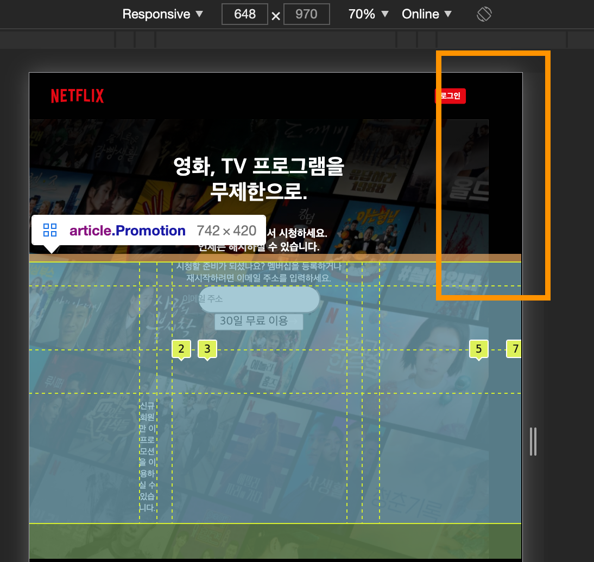

# Style work record
`components` 부분의 작업 과정을 기록합니다.

## Container 

### [문제] 컨테이너에 min-width를 설정했을 때 margin-left가 없어지는 현상

컨테이너에 `375px`로 최소너비를 지정했을 때 `margin-left`의 여백이 없어지는 현상이 나타난다.



### breakPoint 변경
`lg`에서 `x-lg`로 브라우저의 너비가 바뀌는 과정에서 `max-width` 값 때문에 `x-lg`로 바뀔 때 컨테이너의 크기가 갑자기 작아진다. 이를 자연스럽게하기 위해 `x-lg`의 값을 `1300px`로 변경하였다. 

`1300px`의 값은 `lg`에서 `max-width: 92vw`가 적용된 상태에서 컨터이너의 너비가 `1200px`과 가까워지는 값을 확인하여 설정하였다. 

## Link

### resetLink:hover 제거
`resetLink:hover`에서 `textdecoration`이 설정되어 있었다. 이전에 css 작업에서 실수로 전역 스타일로 적용한 것이다. 바로 제거했다. 

### sass에 상태클래스 중첩하기 
왜 적용이 안될까하며 검색했더니 상태클래스를 중첩 할 때는 `&`가 꼭 있어야 한다.
[[stackoverflow]Sass Nesting for :hover does not work](https://stackoverflow.com/questions/15983639/sass-nesting-for-hover-does-not-work)

```scss
.Link {
  border-radius: 3px;
  // ...

  &:focus {
    background: getColor(vividRed);
  }
}
```

