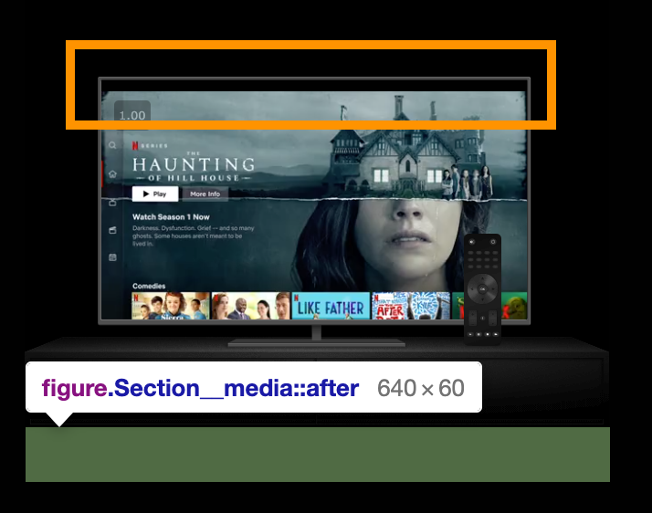
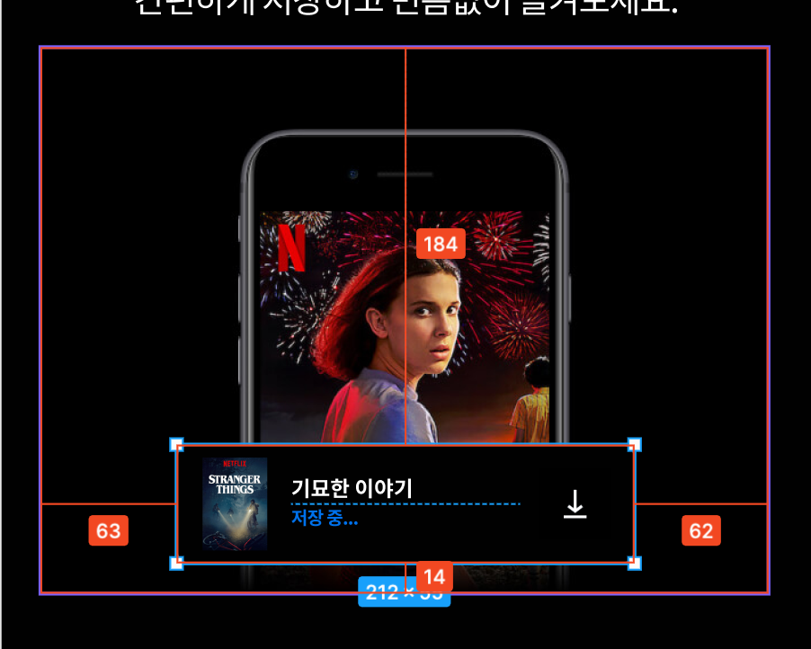

# Style work record
`netflixIntro` 부분의 작업 과정을 기록합니다.

<br />

## figure에 padding-bottom을 적용했을 때 비디오 위치가 변하는 이슈

`figure` 아래 `padding-bottom` 값을 주었다. margin값은  top방향으로만 적용하는 것으로 정했기 때문에 이전의 스타일링할 때 아래에 공간을 주어야 할 때 `padding-bottom을` 사용했다. 

하지만 해당 컨텐츠는 이미지와 비디오가 겹쳐져서 스타일링 한 것이다. 

`video`의 위치를 잡을 때 `%`를 사용했기 때문에 `figure`의 높이가 변하면 비디오의 위치도 변한다. `box-sizing`이 `border-box`으로 설정되어 있어서 `padding`을 설정하면 `figure`의 크기가 변하기 때문이다. 

`--figureHeight`에 `+ padding-bottom`한 값을 넣어줬지만 브라우저의 너비를 가변할 때마다 비디오의 위치가 계속 변했다.

<details>
  <summary>`figure` 코드 보기</summary>

  ```scss
  .Section__media {
  video {
    z-index: -10;
    --figureWidth: 339;
    // padding값도 더해봤으나 여전히 비디오 위치가 변함
    --figureHeight: 255;

    position: absolute;
    top: calc(53 / var(--figureHeight) * 100%);
    left: calc(44 / var(--figureWidth) * 100%);
    width: calc(248 / var(--figureWidth) * 100%);
  }
}
  ```
</details>

<br />

그래서 생각한 방법은 <del>**`::after`을 사용해서 padding 적용하기!**</del>

하지만 figure에 `::after`을 적용해도 <strong>똑같이 비디오의 위치가 변했다.</strong> 



<br />
<br />

`Section`에 가상클래스를 사용해서 `padding-bottom`을 주었다. 

**하지만... 가상요소를 사용하는 것과 직접 적용하는 것과 별다른 차이가 없어서 직접 `padding-bottom`을 적용하는 것으로 결론 내렸다.** 


<br />
<br />

## position:absolute에서 가운데 정렬 방법
아래의 이미지에서 `downloadContent`를 가운데 정렬 하려고한다. 부모요소가 `position:relative`라는 전제에서 아래 코드를 참고하자



<!-- 아래 마크다운 코드를 scss 또는 css로 설정하고 저장했을 때 아래에 입력한 코드가 중복되어 입력되는 오류가 발생해서 아무것도 설정하지 않았음 -->

### 방법 1
```
.downloadContent {
  position: absolute;
  bottom: 16px;
  left: 50%;
  transform: translateX(-50%);
}
```

### 방법 2
```
.downloadContent {
  position: absolute;
  bottom: 16px;
  left: 63px;
}
```

