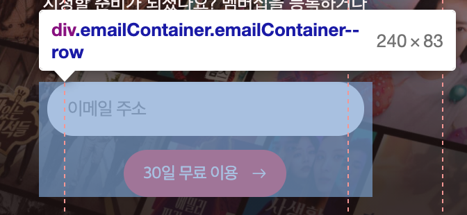

# Style work record
`our story` 부분의 작업 과정을 기록합니다.

## 만들어보기

### Mixin

1. `font-size`, `font-weight`, `line-height`를 반복해서 사용하는 경우가 많다. 해당 믹스인을 한 번 만들어 볼까?

## 기록하기

### background-image가 브라우저에 로딩되지 않는 이슈
`background-image`가 아무리 해도 화면에 로딩되지 않는다. 혹시나 해서 `background-color`를 이용해 색상을 넣었는데 된다?! 도대체 뭐가 문제일까? 


Network 패널에 들어가 해당 이미지 파일을 확인해보니 왜 로딩되지 않았는지 알 수 있었다. 

이미지를 보면 `dist`폴더에서 이미지를 불러온다. 즉, `Sass`가 아닌 `CSS` 파일 기준으로 이미지를 탐색해야한다. 


### Container에 grid에 무작정 고정값을 주면 생기는 이슈


`Promotion`의 마지막 자식요소는 `"신규 회원..."` 단락이다. 하지만 무슨일인지 `padding-bottom`값을 주었지만 마지막 요소부터 적용되는 것이 아니라 위의 이미지와 같은 오류가 생긴다. 

이유는 `Container`의 `grid-template-rows` 마지막 열에 고정값을 주었기 때문에 가변되지 않았던 것이다. 

```scss
.OurStory {
  .Container {
    display: grid;
    grid-template-rows: rem(122px) rem(68px) rem(175px);
  }
}
```

해결 방법이 무엇일까? 바로! `minmax()` 함수를 사용하는 것이다. 이 함수를 사용하면 컨텐츠의 크기에 따라 가변한다. 

`grid`사용해서 반응형 웹을 만들 땐 해당 함수를 잘 이용하는 걸로~!

[[MDN]Grid → minmax()](https://developer.mozilla.org/ko/docs/Learn/CSS/CSS_layout/Grids#minmax_%ED%95%A8%EC%88%98)

```scss
.OurStory {
  .Container {
    display: grid;
    grid-template-rows: rem(122px) rem(68px) minmax(rem(172px), auto);
  }
}
```

이런 오류를 겪고나니 고정값이라는 것이 참 유지보수가 힘들다는 것을 알았다. 고정값으로 작업을 하면 당장은 잘 구현되는 것 같지만 그게 아니다. 이제는 조금 더 시야를 넓게 보고 해당 속성을 사용했을 때 어떻게 구현되는지 앞서 생각할 수 있어야 겠다. 

### Promotion에 그리드는 정답이 아니었다.
`grid`를 사용해 보겠다고 온갖 컨텐츠에 적용하려고 했으나 그리드를 사용해야하는 상황과 아닌 상황을 구분하자.

먼저, 화면의 큰 레이아웃을 잡을 때는 `grid`가 간편하고 쉽다. 하지만 그 안에 작은 컨텐츠의 레이아웃은 `flex`로 하는 것이 더 좋을 듯하다. 

예를 들면 `OurStory`의 큰 레이아웃은 `grid`로 설정하되 그 안에 `Promotion`같은 작은 컨텐츠는 `flex`를 이용하는 것이 좋다. 

왜냐하면 반응형 웹 페이지를 만들 때, 레이아웃이 가변하거나 위치가 변하는 경우를 생각해야 한다. 하지만 반응형까지 고려해서 컨텐츠의 행과 열의 수치를 각각 설정하는 것이 쉽지 않다. 

또한 기존의 부모 요소에 그리드가 적용되어 있어서 간혹 자식 요소에 그리드를 설정할 때 부모요소의 그리드 행과 열 때문에 원하는 대로 위치 잡는 것이 힘들다. 

[예시-1]


[예시-2]


`[예시-1]`은 `emailContainer`에 `grid`를 설정헀을 때 상황이다. 자식요소가 2개이기 때문에 컨텐츠의 개수에 맞춰 `[예시-2]`처럼 나올 줄 알았으나 아니었다. 

`[예시-2]`는 `[예시-1]`의 문제를 확인하고 부모요소인 `OurStory`에 설정된 `grid`를 제거 했을 때이다. 

위에 설명한 대로 부모요소와 자식요소 모두에 `grid`를 설정했을 때 이런 문제를 만날 수 있다.

(그래도 grid`이용해서 테스트 한 것 코드 커밋이라도 해둘걸...)

### input 인터랙션 적용할 때, Sass 선택자 중첩 실수
emailContainer input에 인터랙션을 적용할 때 Sass의 선택자를 중첩할 때 잘 못 사용하는 바람에 스타일링이 적용이 되지 않았다. 

상태 클래스를 중첩 할 때 각각 다른 상태일 땐 그에 맞게 따로 선택자를 입력해줘야 하지만 코드가 많아지고 2-3번 중첩되다 보니 헷갈렸다. 

`emailContainer__block`와 `emailContainer__block--invalid`는 각각 다른 상태이다. 하지만 위에서 보다시피 `__block` 안에 `--invalid`를 넣어줬다.

[올바르지 않은 중첩 선택자 사용 예시]
```scss
.emailContainer {
  &__block {
    input:focus + label,
    &__block--valid label,
    &__block--invalid label {
      top: 3px;
      left: 20px;
      font-size: rem(11px);
    }

    // 또는 

    [role='alert'] {
      display: none;
    }
  
    &__block--invalid [role='alert'] {
      display: block;
    }
  }
}
```
각각 다른 상태는 나타내는 클래스를 중첩할 때는 아래와 같이 따로 작성해야 한다. 

[올바른 중첩 선택자 사용 예시]
```scss
.emailContainer {
  // emailContainer____block
  &__block {
    input:focus + label {
      top: 3px;
      left: 20px;
    }

    [role='alert'] {
      display: none;
    }
  }

  // emailContainer____block--valid (--nvalid)
  &__block--invalid [role='alert'] {
    display: block;
  }

  &__block--valid label,
  &__block--invalid label {
    top: 3px;
    left: 20px;
  }
}
```

### emailContainer에 Grid는 정답이 아니었다. 
나름 `grid`를 사용해보려고 했다. 혹시나 했는데 역시나 잘 안된다. 컴포넌트 처럼 `--row` 상태일 때 모바일 버전에서도 `row`로 바뀌길 바랬으나 `input`의 위치가 바뀌질 않는다. 여기서 알게된 점은 `grid-row`, `grid-column`은 덮어쓰기가 되지 않는다. 

[emailContainer]


[emailContainer--row]


<details>
  <summary>코드 보기</summary>

  
```scss
.emailContainer {
  display: grid;
  grid-template-columns: 1fr minmax(rem(121px), auto) 1fr;
  grid-template-rows: 1fr minmax(rem(34px), auto);

  &__block {
    grid-row: 1;
    grid-column: 1/-1;
  }

  button {
    grid-row: 2;
    grid-column: 2;
  }
}

.emailContainer--row {
  grid-template-columns: 1fr minmax(rem(131px), auto);
  grid-template-rows: 1fr;

  &__block--row {
    grid-column: 1/2;
  }

  button {
    grid-row: 1;
  }
}
```
</details>

### emailContainer에 flex 적용 시 button 모양 변형 이슈
`grid`로 레이아웃 잡는 것을 실패하고 flex를 적용했을 때 버튼의 너비가 컨테이너의 크기만큼 커지는 현상이 발생했다. 

[`flex` 적용 전]



[`flex` 적용 후]


[`button`에 `margin-left/ right: auto` 설정]

버튼에 margin 값을 주어 크기를 잡았다. 


### Desktop 버전에서 input:valid 상태에서 button 높이 변형


위와 같이 `valid/invalid` 상태일 때 `button`의 높이가 변한다. 

인접 형제 선택자를 사용해서 `valid/invalid` 상태일 때만 높이가 `60px`에 고정되도록 했다. 
```scss
&__block--valid,
&__block--invalid {
  @include media('>=lg') {
    + button {
      height: rem(60px);
    }
  }
}
```


